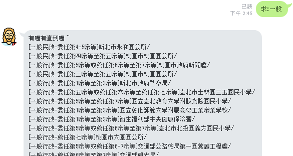
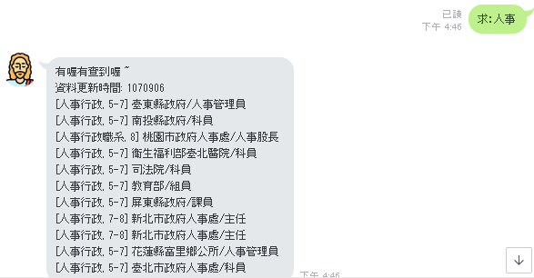

# 處理訊息需求

可以接收到使用者的訊息後，接著就是要處理訊息。接收訊息之後，觸發機器人搜尋的關鍵字是「求:」，後面就是要搜尋的字串，我要的功能很簡單，就只要可以搜尋「職系」這個欄位就好。  
例如：使用者傳「求:一般行政」，就可以搜尋「一般行政」的職系。找不到內容就說回傳「找不到這個職系」

## 字串的全半形轉換

因為有可能收到的冒號是全型的，為了方便處理，一開始會先將字串都轉為半形符號，以下是全半形轉換的 method，使用 `str.tr()` 可以一對一的更換字元：

```ruby
  def to_half(str)
    full = "　！＂＃＄％＆＇（）＊＋，－．／０１２３４５６７８９：；＜＝＞？＠ＡＢＣＤＥＦＧＨＩＪＫＬＭＮＯＰＱＲＳＴＵＶＷＸＹＺ［＼］＾＿｀ａｂｃｄｅｆｇｈｉｊｋｌｍｎｏｐｑｒｓｔｕｖｗｘｙｚ｛｜｝～"
    half = " !\"\#$%&'()*+,-./0123456789:;<=>?@ABCDEFGHIJKLMNOPQRSTUVWXYZ[\\]^_`abcdefghijklmnopqrstuvwxyz{|}~" 
    str.tr(full, half)
  end
```

然後在 `keyword_reply` 中將字串先作轉換，然後用 `[2..-1].strip` 把第二個字以後的字串都取出來

```ruby
  def keyword_reply(received_text)
    if !received_text.present?
      return
    end
    received_text = to_half received_text 
    if received_text[0..1] == '求:'
      # 把剩下的字串取出
      # received_text[2..-1].strip
      # 然後開始查資料庫
    else
      return
    end
  end
```

這樣就可以取到我要查的字串了

# 處理職等問題

在事求人上面的職等，通常都會打一大串  
  
像是「薦任第六職等到第七職等」這樣的字串，其實很佔版面，理想上應該只需要看到「6-7」這樣就知道這個職缺的職等是多少，所以在抓取資料的時候，我就要先將職等的字串做清理。  
(本段程式碼寫在 update 資料的 rake file 裡面)

## 中文數字轉換

把中文數字換成阿拉伯數字。要注意的是「十」會變成「10」，所以我會另外用 `gsub` 處理

```ruby
cnum_tr = "一二三四五六七八九"
num_tr ="123456789"
newStr=str.tr(cnum_tr,num_tr).gsub("十","10")
```

這樣「薦任第六職等到第七職等」就會變成「薦任第6職等到第7職等」，「簡任第十職等到第十三職等」會變成「簡任第10職等到第103職等」，所以「10」的部分我會再另外把中間那個「0」拿掉。  
這裡使用 `gsub` ：除了可以直接取代字串外，也可以用 regular expession 搜尋符合「10x」條件的三位數字，然後在 block 中處理搜到的結果：

```ruby
newStr=str.tr(cnum_tr,num_tr).gsub("十","10").gsub(/10[0-9]/){|s|s[1]='';s}
```

這樣「簡任第十職等到第十三職等」就會正確的轉換到「簡任第10職等到第13職等」

## 抓出職等數字

接著要把「簡任第10職等到第13職等」轉換成 「10-13」  
1.首先使用 `gsub(/[^0-9]," ")` 把中文字取代成空格，變成「 10 13 」  
2.`.scan()` 可以用 regular express 把所有符合的字串切成一個字串陣列。`.scan(/\d+/)`可以把上面的字串切成 `["10","13"]`  
3.然後 `.join('-')` 把字串用 `-` 串接起來，結果變成 `"10-13"`  
4.另外有種狀況是「委任五職等，薦任六到七職等」這種有三個數字的，經過上面的結果會變成`"5-6-7"`，但我只要 `"5-7"` ，所以必須把中間那個數字 `"-6-"`取代掉 : `.gsub(/\-[0-9]\-/,'-')`

綜合以上，最後的職等轉換就變成落落長一串....

```ruby
cnum_tr = "一二三四五六七八九"
num_tr ="123456789"
newStr=str.tr(cnum_tr,num_tr).gsub("十","10").gsub(/10[0-9]/){|s|s[1]='';s}.gsub(/[^0-9]/," ").scan(/\w+/).join('-').gsub(/\-[0-9]\-/,'-') if item['RANK']
```

最後的結果  


# 總結用到的功能

*   `str.tr(arr1,arr2)`: 把 arr1 的字元換成 arr2 的字元
*   `str.gsub()`: 取代字串，搭配 regular expression，也可以丟到 block 裡面處理
*   `str.scan(RegExp)`：掃描字串，將符合 regular expression 的字串切成陣列
*   `arr.join`：將 array 合併成字串

覺得處理到字串的問題，還是要好好的練一下 regular expression。