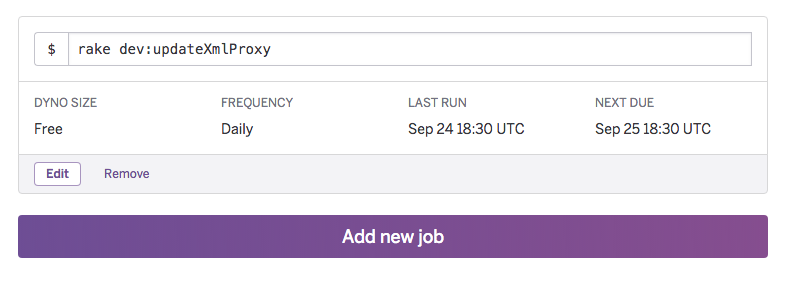

# 更新排程

這隻用 rails 寫好的 webhook 部署在 heroku 上面，免費機器除了定時會睡覺之外，基本上沒啥問題(反正一開始也沒什麼人要用...)，而資料庫更新的部分我寫在一隻 rake file 內，每天半夜排程執行一次。heroku 提供了一個免費的排程器 [Heroku Scheduler](http://https://devcenter.heroku.com/articles/scheduler) add on ，但是要使用的話必須先通過信用卡驗證。

在專案下安裝 Scheduler add-on

```bash
$ heroku addons:create scheduler:standard
```

然後輸入下面指令，可以打開 scheduler 設定頁面

```bash
$ heroku addons:open scheduler
```

在畫面上輸入指令以及執行時間。例如我要叫 heroku 執行 `rake dev:updateXmlProxy`，就在畫面上設定  


## 在 Ubuntu 設定 crontab

為什麼會多出這一段設定呢？因為人事行政局竟然會擋 heroku 的主機，想不到要利用個開放資料真的是困難重重...  
於是我就在自己租用的 linode 主機上先寫好一隻下載 xml 的 shell script _updateXml_，然後在 Ubuntu 設定 crontab 執行

**crontab 的指令**

*   `$ crontab -l`: 列出所有排程
*   `$ crontab -e`: 編輯 crontab
*   `$ crontab -r`: 將使用者的 crontab 全部清除

**crontab 的格式**

```
# 文件格式说明
#  ——min（0 - 59）
# |  ——hour（0 - 23）
# | |  ——day（1 - 31）
# | | |  ——month（1 - 12）
# | | | |  ——week（0 - 7，星期日=0或7）
# | | | | |
# * * * * * 要被執行的命令
```

例如我要設定每天一點執行 **updateXml** 這隻 sh，就要這樣寫：

```
0 1 * * * sh ~/updateXml
```

_補充_ 使用 wget 下載網頁的 shell script：

```
#!/bin/bash
wget "網址" --output-document=/var/www/html/doc/test.xml --no-check-certificate
```