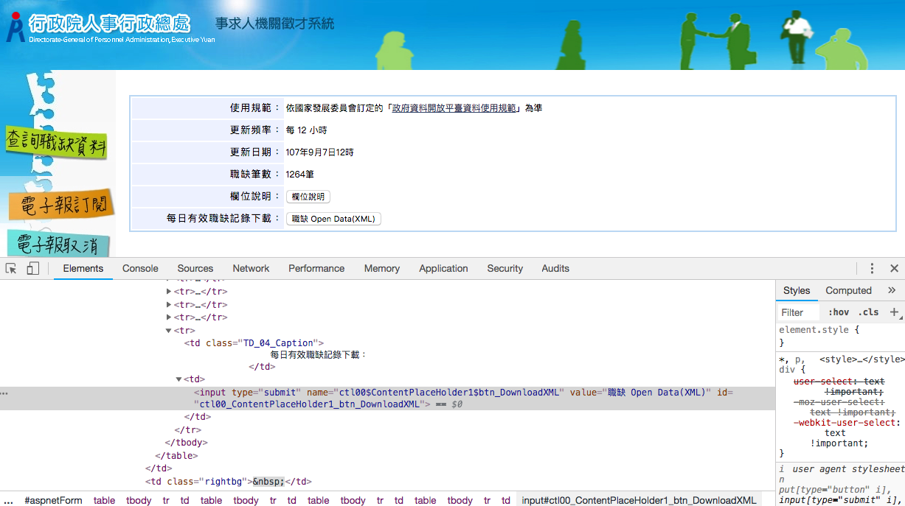
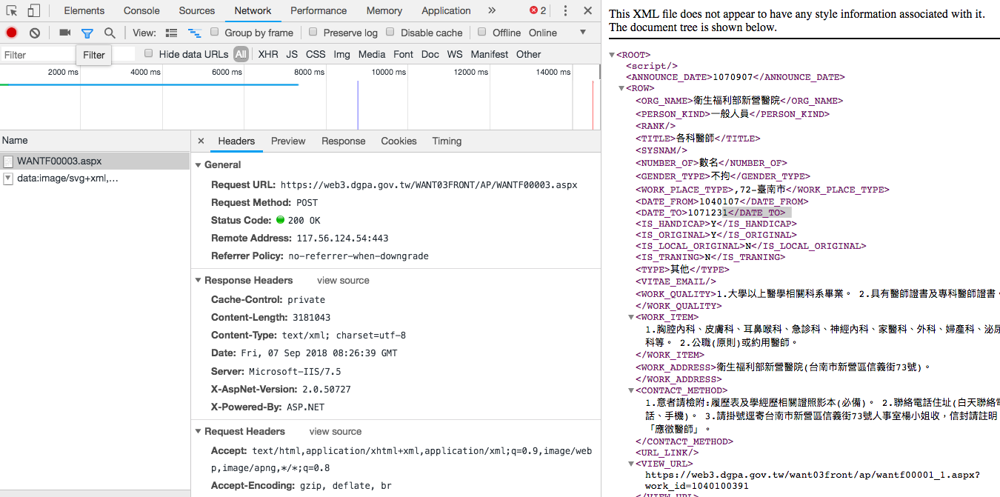
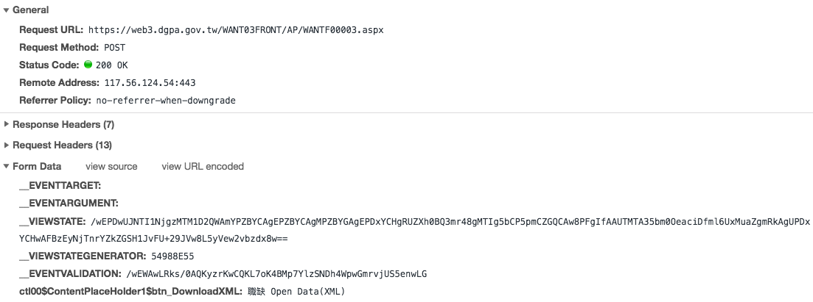
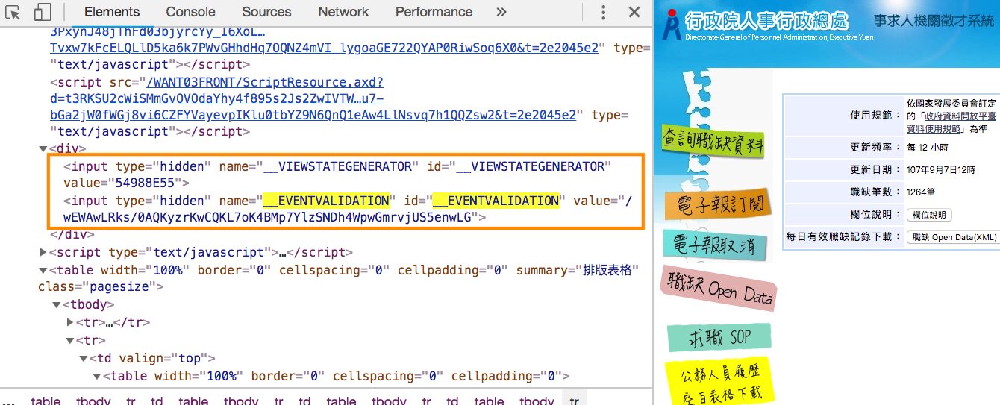
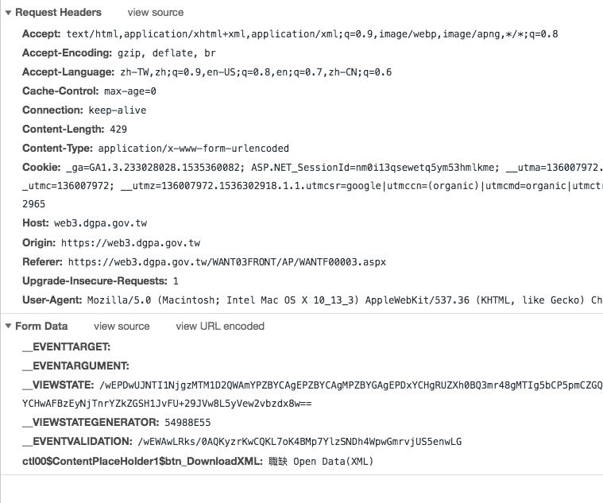

在 [做一隻事求人 Line Bot - (1) init](https://www.spreered.com/zuo-yi-zhi-shi-qiu-ren-line-bot/) 裡有寫到，人事行政局有釋出[事求人開放資料](https://web3.dgpa.gov.tw/WANT03FRONT/AP/WANTF00003.aspx)，但為什麼我們還需要來實作爬蟲呢？

其實心情蠻無奈的...政府推動開放資料也好幾年了，各機關推出的資料品質不一之外，好像希望你不要用這些開放資料一樣。打開這個事求人開放資料網頁，它並沒有提供 **XML** 檔案或 **JSON** 檔，而是給你一個按鈕，送出 POST 之後才吐給你 xml 的資料...

  
開啟 dev tool 確認，的確是送 POST  


於是我還是需要寫一隻爬蟲去把 xml 抓出來

* * *

# 擬定戰略

首先要觀察一下 devtool的瀏覽器行為，看瀏覽器怎麼取得資料的  
  
按下按鈕後，client 端送出了 **POST** [https://web3.dgpa.gov.tw/WANT03FRONT/AP/WANTF00003.aspx](https://web3.dgpa.gov.tw/WANT03FRONT/AP/WANTF00003.aspx) ，然後夾帶了一串 Form Data ：

*   `__EVENTTARGET`:
*   `__EVENTARGUMENT`:
*   `__VIEWSTATE`: \[....\]
*   `__VIEWSTATEGENERATOR`: \[.....\]
*   `__EVENTVALIDATION`: \[....\]
*   `ctl00$ContentPlaceHolder1$btn_DownloadXML`: 職缺 Open Data(XML)

查了一下 `__EVENTVALIDATION` 那串資訊都是 asp 用來防止表單被 csrf 攻擊的作法，也就是在原本按鈕的頁面上，在 from 標籤有夾帶著一串隱藏的欄位  
  
當 submit 按鈕送出時，這些參數會被夾帶在 Form data 裡面作為驗證。

所以到這我擬定的爬蟲戰略是：

1.  先 GET [https://web3.dgpa.gov.tw/WANT03FRONT/AP/WANTF00003.aspx](https://web3.dgpa.gov.tw/WANT03FRONT/AP/WANTF00003.aspx) ，把 html 抓下來
2.  把這些隱藏的 form token 抓出來
3.  再發送 POST [https://web3.dgpa.gov.tw/WANT03FRONT/AP/WANTF00003.aspx](https://web3.dgpa.gov.tw/WANT03FRONT/AP/WANTF00003.aspx) ，把剛剛抓下來的那些 token 塞進去，應該就可以收到我們要的 xml 資料。

# 使用工具

*   [nokogiri](http://www.nokogiri.org/) : 一個 ruby gem，用來做 html、XML、SAX 的 parser，搜尋元素很好用
*   [openuri](https://ruby-doc.org/stdlib-2.1.0/libdoc/open-uri/rdoc/OpenURI.html)： ruby 內建的 Module， GET mehtod 開網頁很好用，用來搭配 nokogiri
*   [rest-client](https://github.com/rest-client/rest-client)：ruby gem，也是用來發送請求使用的，以下使用它來發送 POST 。

# nokogiri

安裝

```
gem  install nokogiri
```

在 **.rb** 檔案中要引入 **nokogiri** 和 **open-uri**

```
require 'nokogiri'
require 'open-uri'
```

讀檔方面，可以搭配 `File.open` 來開啟本地端檔案，或者使用 open-uri 的 `open` 來開啟網址。

```ruby
html_doc = Nokogiri::HTML( File.open("example.html") )
xml_doc  = Nokogiri::XML( File.open("example.xml") )
url = 'http://www.google.com/'
doc = Nokogiri::HTML(open( url ))
```

完成讀檔之後，可以透過 `.xpath()` 來過濾內容。  
搜尋 `a` 標籤

```ruby
doc.xpath("//a")  
```

就會取出一連串的 a 標籤 html element array

```
<a href="xxx">aaa</a>
<a href="xxx">bbb</a>
<a href="xxx">ccc</a>
```

利用階層的方式選定 `p` 裡面的 `span` 標籤，並且使用`.text` 來取出標籤內的 text content

```ruby
doc.xpath("//p/span").text  
```

取出 `h3` 裡 `a` 標籤的 `href` 屬性

```ruby
doc.xpath("//h3/a")[0]['href']
```

直接搜尋包含 `data-id` 屬性的 html element

```ruby
p doc.xpath( "//@data-id" )
```

**其他 nokogiri 參考資料**

*   [http://www.nokogiri.org/tutorials/](http://www.nokogiri.org/tutorials/)
*   [https://wwssllabcd.github.io/blog/2012/10/25/how-to-use-nokogiri/](https://wwssllabcd.github.io/blog/2012/10/25/how-to-use-nokogiri/)
*   [https://mgleon08.github.io/blog/2016/02/07/ruby-crawler/](https://mgleon08.github.io/blog/2016/02/07/ruby-crawler/)
*   [http://carlos-blog.logdown.com/posts/2016/06/10/reptile-series-approach](http://carlos-blog.logdown.com/posts/2016/06/10/reptile-series-approach)
*   nokogiri 編碼問題 [http://www.iteye.com/problems/75134](http://www.iteye.com/problems/75134)

## 實作

以下是利用 **nokogiri** 來抓取事求人網頁中隱藏的 input value

```ruby
require 'active_support/all'
require 'rest-client'
require 'nokogiri'
require 'open-uri'

base_url = 'https://web3.dgpa.gov.tw/WANT03FRONT/AP/WANTF00003.aspx'
page = Nokogiri::HTML(open( base_url ),nil,"utf-8")
__VIEWSTATEGENERATOR =  page.xpath('//input[@name="__VIEWSTATEGENERATOR"]/@value').first.value
__VIEWSTATE =  page.xpath('//input[@name="__VIEWSTATE"]/@value').first.value
__EVENTVALIDATION =  page.xpath('//input[@name="__EVENTVALIDATION"]/@value').first.value
```

* * *

# 使用 Rest-client 發送 POST

蒐集到 POST form data 所需要的資料後，我們還需要知道 request header 要放什麼。  
因為有些伺服器會去檢查 request header 中的一些資訊來確認你是個正常的使用者，所以查看一下先前我們在瀏覽器中發出的 request header 長什麼樣子：  


這裡我挑了幾個比較重要的項目來放：

*   content-type: request body 內訊息的格式。
*   user\_agent: 來判別你是從哪個瀏覽器連過來的，加上這個參數假裝我們是瀏覽器。
*   referer: 從哪個頁面來發送請求的

準備好了 request header 和 request body ，接著就使用 rest-client 實作 POST method。實作程式碼如下：

```ruby
params = {
    '__VIEWSTATEGENERATOR'=>__VIEWSTATEGENERATOR,
    '__VIEWSTATE'=>__VIEWSTATE,
    '__EVENTVALIDATION'=>__EVENTVALIDATION,
    '__EVENTTARGET'=>'',
    '__EVENTARGUMENT'=>'',
    'ctl00$ContentPlaceHolder1$btn_DownloadXML'=>'職缺 Open Data(XML)' 
  }

xmlData = RestClient.post(base_url,params, 
    {
        content_type: 'application/x-www-form-urlencoded',
        user_agent:"Mozilla/5.0 (Macintosh; Intel Mac OS X 10_13_3) AppleWebKit/537.36 (KHTML, like Gecko) Chrome/68.0.3440.106 Safari/537.36",
        referer:'https://web3.dgpa.gov.tw/WANT03FRONT/AP/WANTF00003.aspx'
    })
```

測試的結果是成功的，的確拿到了滿滿的一串 xml!

# 將 xml 轉成 hash

為了要方便 ruby 使用資料，接著把 xml 轉為 hash type

```ruby
    data = Hash.from_xml(xmlData.to_s)
```

在 Rails 中就可以寫個 rake task 來把這些資料塞到資料庫裡。

* * *

# 其他參考資料

*   [python 3.x 爬蟲基礎---http headers詳解](https://hk.saowen.com/a/704c30f9995d4e2eeb75dac65e3b96b3419b84c500105e9025beb0ca2060f336)
*   [爬蟲入門到精通-headers的詳細講解（模擬登錄知乎）](https://segmentfault.com/a/1190000009111635)
*   [pyton簡單網絡爬蟲，aspx網站中form使用到了\_\_VIEWSTATE、\_\_EVENTVALIDATION、cookie來驗證的提交](http://blog.51cto.com/slliang/1783837)