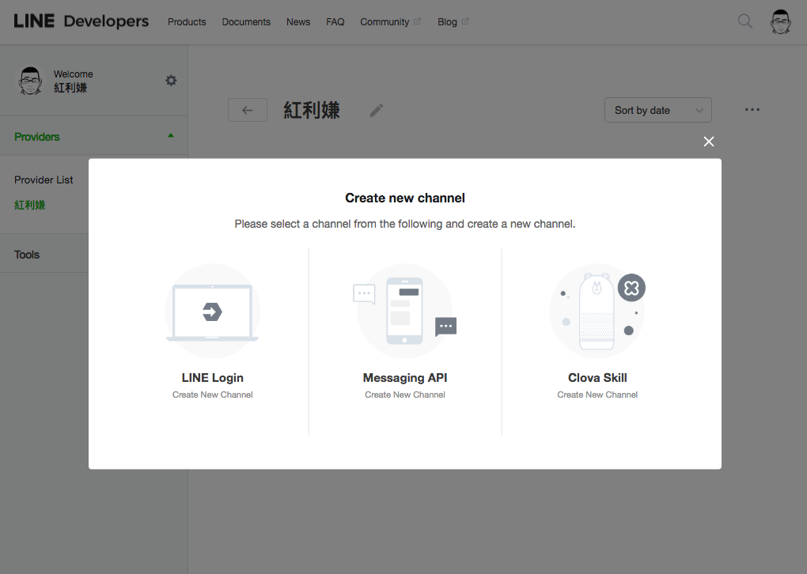

# 申請一個 line message api

1.  到 [Line developer](https://developers.line.me/en/) 申請一個帳號
2.  在帳號頁面新增一個 Provider。  
    
3.  新增一個 channel，選擇 Line message api  
    
4.  接著填寫一些基本資訊和方案選擇。開發者方案可以有 50 人好友上限，免費版本無上限，但要注要的是免費版本是不能主動發送訊息的，只能回訊息。
5.  完成！  
    

# 設定基本訊息

Message api 會直接幫你建一個 line@ 帳號，要編輯帳號的一些資訊要到 Line @ 的後台去處理，而不在 Line developer 的頁面。  


連程式都不用寫，在 Line @ 的後台可以直接設定一些常用的基本訊息，關鍵字回覆  


但因為我需要串接事求人的資料，所以要想辦法串接後端

# 運作原理

1.  User 發送訊息給 Line Bot
2.  line 會把 User 發送的東西（文字檔案聲音等等）包裝成一個 ”event“，並且把 event 打包成一個 JSON ，裡面會夾帶著 `replyToken`、使用者id、訊息

```json
{
    "events"=>[{
        "type"=>"message", 
        "replyToken"=>"d38f53b172f543f9b616bc9404d0441d", 
        "source"=>{
            "userId"=>"Ua52b39df3279673c4856ed5f852c81d9", 
            "type"=>"user"
        }, 
        "timestamp"=>1536418583676, 
        "message"=>{
            "type"=>"text", 
            "id"=>"8543204372501", 
            "text"=>"來自使用者的訊息啦"
        }
    }],
}
```

3.  Line 將打包的這個 event ，POST 到我們自己撰寫的 web api，在這裡叫做 **webhook**。
4.  我們接收到 event 後，就可以拿 `replyToken` 回覆訊息。  
    \- 要注意的是一個 reply token 只能回五則訊息，並且幾秒後就會失效。  
    \- 回覆文字訊息，一則最多 2000 字 。  
    \- 還有圖片、地理位置等其他回覆型態，可以參考[官方的說明](https://developers.line.me/en/reference/messaging-api/#message-event)

# 設定 line message api

回到 line developer 頁面，在 line message api 設定頁面中有一欄 **message setting** 下，**Webhook URL** 可以設定我們自己撰寫的 api  


Webhook 一定要 https 的網址，heroku 的免費方案提供的網址就是 https 了。因為 Line 會做些驗證，最好是要放 webhook 的這段 api 先寫好推到 heroku 上，再設定網址。  
另外這個頁面上有兩個參數很重要，有點像是 Private key：

*   Channel secret
*   Channel access token  
    如果是空的，按下 issue 按鍵就可以產生了。這兩個 Key 要放在我們自己的 server side，讓 line 主機驗證使用的。

下一篇要來講怎麼用 rails 寫一個 webhook