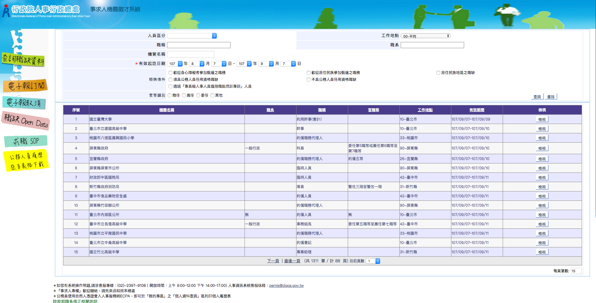
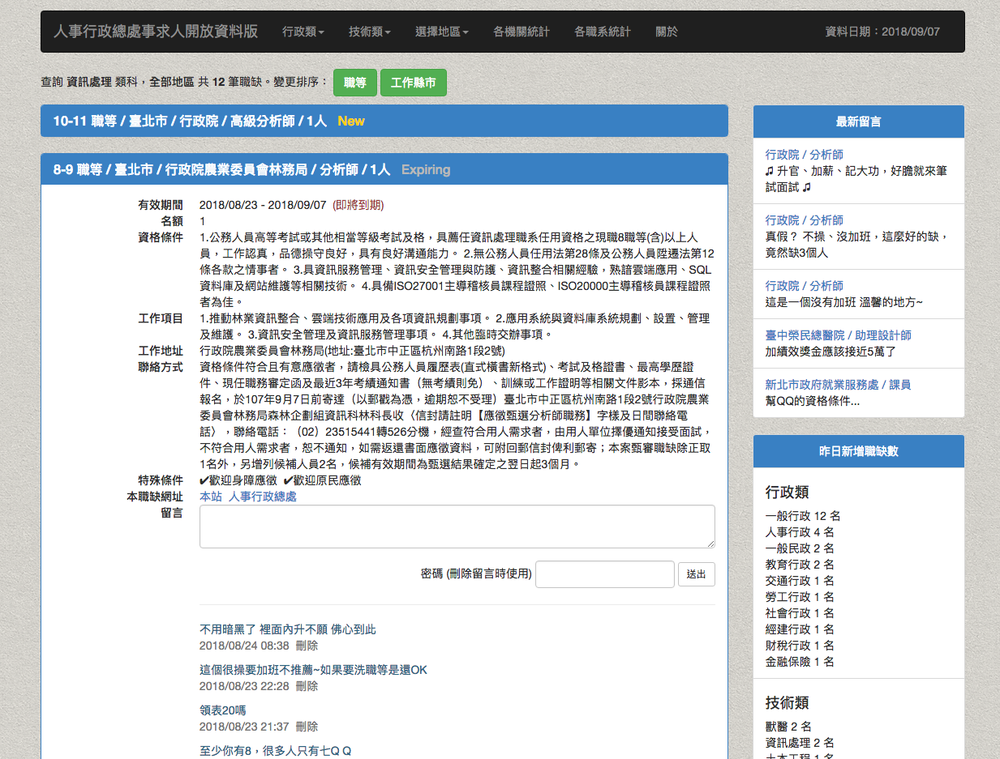

# 有事求神，沒事求人

這是一隻使用行政院人事行政局事求人 Open data 資料來製作的一隻 line chat bot，讓你可以隨時隨地查詢公務員職系的職缺  

如果要加上查詢地區，可以在職系後方加上逗號  
例如：「求：一般行政,臺北」

  
[加入好友](https://line.me/R/ti/p/%40igk4431b)

本段程式的原始碼：[https://github.com/spreered/ask-job](https://github.com/spreered/ask-job)

如果有使用上任何問題，歡迎 email 與我聯繫： [spreered@gmail.com](mailto:spreered@gmail.com)

# 緣由

為什麼會想要做一隻事求人的 chat bot 呢？  
作「公」以來，三不五時去看一下[人事行政局事求人系統](https://web3.dgpa.gov.tw/want03front/AP/WANTF00001.ASPX?uid=33) 但是每次要查都覺得不太舒服，字小、資訊雜，查詢功能雖多但是要固定查的其實只有固定那些項目。  
  
開始自修程式以來，一直想寫一隻爬蟲來把事求人的東西爬下來，然後做一個比較易用版的 app，於是乎 python 的線上課程買了好幾年就靜靜的躺在那邊，遲遲沒有開始 ...

前幾個禮拜，同事貼了 [http://opencpa.castman.net/](http://opencpa.castman.net/) 這個給我，原來是位曾任公務員的網路某大大幫大家完成了這個心願，的確好用非常多，做了很多排序和過濾，還可以匿名留言 ...  
  
原來這個站是利用人事行政局的 [Open data](https://web3.dgpa.gov.tw/WANT03FRONT/AP/WANTF00003.aspx) 來實作的。

想到去年**郭佳甯**大大有將**卡米狗** Line bot 的製作方法寫在 [ithome 鐵人賽裡面](https://ithelp.ithome.com.tw/users/20107309/ironman/1253) ，另外也有出[書](https://www.tenlong.com.tw/products/9789864342938)，於是決定參考卡米狗的作法自己來做做這個有趣實用的 side project。

花了幾天弄出來～過程蠻有趣的

這系列文章將記錄一下開發中遇到的相關議題：

*   [做一隻事求人 Line Bot - (2) 使用 Ruby 實作爬蟲](https://www.spreered.com/ask-job-line-bot-2-ruby-crawler/)
*   [做一隻事求人 Line Bot - (3) line message api](https://www.spreered.com/ask-job-line-bot-3-line-message-api/)
*   [做一隻事求人 Line Bot - (4) 撰寫 webhook](https://www.spreered.com/ask-job-line-bot-4-webhook/)
*   [做一隻事求人 Line Bot - (5) 字串處理](https://www.spreered.com/ask-job-deal-with-string/)
*   [做一隻事求人 Line Bot - (6) 部署與更新](https://www.spreered.com/ask-job-deploy-and-job/)