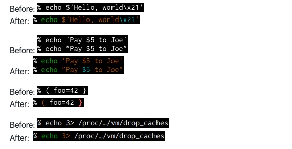

剛開始寫程式的時候跟 terminal 很不熟，隨便在網路上找了一些 iterm + zsh + oh-my-zsh 的介紹文章來弄，到底裝了什麼也不太清楚，只知道很炫！  
最近透過重灌電腦的機會，順便整理了一下自己的 terminal 設定檔（a.k.a dotfile)，過濾出一些必要的開發套件，這篇主要是分享一下目前自己的設定和踩雷心得。

# iTerm2

mac 上的 terminal 蠻陽春的，iterm 2 的功能比較完善，例如我覺最常用的分割視窗功能：

*   `command` + `d` 垂直分割視窗
*   `command` + `shift` + `d` 水平分割視窗
*   `command` + 方向鍵 切換分割視窗
*   `command` + `t` 開新的 tab
*   `command` + 方向鍵 切換tab

iterm 還支援搜尋文字 highlight，`滑鼠右鍵 + cmd` 可以直接在 iterm 裡面直接對程式碼連結開啟編輯器等等我都覺得還不錯，更多功能可以參考 [iterm 的 feature 列表](https://iterm2.com/features.html)

> btw 最近我才知道原來 iterm 其實最強大的是[跟 tmux 可以作無縫整合](https://toutiao.io/posts/q86tnu/preview)。

不過除了功能之外，美觀還是很重要

### color scheme

想要挑好看的 iterm 配色，可以 google 下關鍵字 `iterm color scheme` 之類，或者在 [https://iterm2colorschemes.com/](https://iterm2colorschemes.com/) 這裡給有選擇障礙的你挑一個看得爽的 color scheme。  
下載好後可以在 `preference > profiles > default > color` 設定。

> 我自己目前是使用 [railscasts](https://github.com/rickharris/vim-railscasts) 配色。

### font

對於程式設計師來說，看得開心的字體很重要，重點是要挑 **monospace** 的字體看起來才會舒服。  
可以 google 下關鍵字 `monospace font developer` 之類的關鍵字可以找到很多推薦還是什麼年度排名的可以選。  
下載好安裝之後可以在 `preference > profiles > default > text` 內設定，如果覺得預設字太小也可以在這邊順便改一改。

> 我目前是使用 [source code pro](https://github.com/adobe-fonts/source-code-pro)

### 其他 iterm 設定

開新 session 預設開啟上一個 session 的相同路徑：

*   `preference > profiles > default > general > working directory` 選擇 `reuse previous session's directory`

視窗捲很長不會被吃掉

*   `preference > profiles > default > general > terminal` 把 `unlimited scrollback` 勾起來

# zsh

首先給新手補充點小知識 - **shell** 這個東西是什麼？

我們的作業系統在電腦上運作時，人類需要有個介面來對作業系統的核心來下達指令，以前還沒有什麼 gui 介面的時候，就是透過終端機這種文字介面 ( command line interface ) 來跟電腦溝通。負責這個溝通的文字介面程式就叫做 **shell**。 像是 mac os 或 linux 這種師出同源的 \*nix-based 作業系統，預設的 shell 程式都是 **bash**。

> 有興趣的可以先去看一下[鳥哥介紹 bash shell的文章](http://linux.vbird.org/linux_basic/0320bash.php#bash)

然後接下來就是要把這個預設的 bash 換成 z shell（也就是 zsh）。在 command line 直接透過 [homebrew](https://brew.sh/index_zh-tw) 來安裝 zsh

```bash
$ brew install zsh
```

這樣就好哩。來卻認一下有沒有換成功：

```bash
$ echo $shell
/bin/zsh
```

其中 `echo` 指令可以幫我們**顯示** 我們 shell 裡面變數（對沒錯，終端機環境裡面也有變數可以用），`$shell` 這個變數就是放目前 shell 是用哪支程式，如果顯示 zsh 那就是表示有換成功啦。

### zshrc

接下來我們要裝一些好用的套件，首先要了解一下 `.zshrc` 這個東西。  
當我們開啟新的 terminal 分頁或視窗，會開始執行 bash 或 zsh 這些 shell 程式，然後它們一開始會先去讀你家目錄下面的一些設定檔案：

*   如果是 bash，會去讀 `~/.bashrc` `~/.bash_profile` `~/.bash_login` 等等
*   如果是 zsh，會去讀 `~/.zshrc` 等等

那個 "等等" 不重要，主要是知道 zsh 預設一定會讀 `.zshrc` 的就好。  
然後 `.zshrc` 裡面要寫的東西，其實就是在 shell 裡面執行的指令，所以就是一開啟 zsh 的時候就會先把 `.zshrc` 裡面的指令執行一次的意思

### zplug

[https://github.com/zplug/zplug](https://github.com/zplug/zplug)

大部分比較好找到的 zsh 套件管理程式是 **oh-my-zsh**，但是它有點肥，然後裝很多不知道幹嘛的東西。

後來我用了 **zplug** 這個 zsh 套件管理程式，需要什麼套件再透過 zplug 裝就好。

> 我個人沒特別偏好哪套 zsh plugin 管理系統，想選用其他的的參考 zplugin (已經改名叫 zinit)、antibody、zr 等等  
> 另外聽說 zplugin 應該是[加載速度最快的](https://gist.github.com/laggardkernel/4a4c4986ccdcaf47b91e8227f9868ded)

mac 請直接透過 homebrew 安裝 zplug：

```bash
$ brew install zplug
```

然後就可以在 `.zshrc` 裡面撰寫基本的 script

```bash
source ~/.zplug/init.zsh

# ===以下這塊用來定義要使用什麼套件===
zplug "zsh-users/zsh-history-substring-search"
zplug "jxck/dotfiles", as:command, use:"bin/{histuniq,color}"
zplug "tcnksm/docker-alias", use:zshrc
zplug "k4rthik/git-cal", as:command, frozen:1
# ...
# ====================================

# 以下這段是檢查如果有套件沒安裝過，會出現提示訊息問你要不要安裝
if ! zplug check --verbose; then
    printf "install? [y/n]: "
    if read -q; then
        echo; zplug install
    fi
fi

# 載入 plugin
zplug load --verbose
```

所以之後要安裝套件都可以在裡面新增 `zplug "你的套件名稱“` 來安裝，他預設會去找 github 的 repo 或本地的 oh-my-zsh 資料夾  
然後在 command line 輸入 `zplug install` 就會幫你抓下來安裝，非常方便！

> 更多設定的細節可以參考官方的 [readme](https://github.com/zplug/zplug/blob/master/readme.md)

接下來要介紹幾個比較重要的功能 / plugin

### zsh completion

zsh 預設會提供基本的補完功能，例如 command 或 path 等，但是我們可以啟用內建更強大的補完功能。

啟用的方式有兩種：

1.  直接輸入指令 `compinstall`，zsh 會一步步詢問你要怎樣的 completion 功能，並且直接幫你設定 zshrc
2.  在 `.zshrc` 中貼上一行 `autoload -uz compinit && compinit` (建議）

(其實第一種作法最後還是會幫你在 `.zshrc` 中加入 2 的指令。)

接著就可以開始來進階設定 completion 的功能，以下是我自己的設定偏好：

> 不管大小寫以及子句搜尋

在 `~/.zshrc` 內新增下面的指令

```bash
# case-insensitive (all), partial-word and then substring completion
zstyle ':completion:*' matcher-list 'm:{a-za-z}={a-za-z}' \
    'r:|[._-]=* r:|=*' 'l:|=* r:|=*'
```

> 設定 tab 列出候補清單可以用方向鍵選擇項目

在 `~/.zshrc` 內新增下面的指令

```bash
zstyle ':completion:*' menu yes select
```

> 讀取其他的 completion 清單

除了內建的 completion 的內容之外，homebrew 本身也自帶了 completion 的內容給 zsh 讀取，但是有可能 zsh 並不知道 homebrew 把這些 completion 清單放在哪裡，這時候看參考 [homebrew 官網的設定教學](https://docs.brew.sh/shell-completion) 在 `.zshrc` 內新增：

```bash
if type brew &>/dev/null; then
  fpath=$(brew --prefix)/share/zsh/site-functions:$fpath

  autoload -uz compinit
  compinit
fi
```

這段程式碼就是跟 zsh 說要去哪邊找這些 completion 的檔案。

另外 zsh comletion 會幫你建一個 cache 檔案 `~/.zcomdump`，如果對於 completion 清單內容有變更設定的話，最好還是把個 cache 砍掉重練：

```bash
$ rm -f ~/.zcompdump
$ compinit
```

網路上也有人會客製自己的 completion，有興趣可以參考 [zsh-completions 上的教學](https://github.com/zsh-users/zsh-completions/blob/master/zsh-completions-howto.org)

### zsh-syntax-highlighting

[https://github.com/zsh-users/zsh-syntax-highlighting](https://github.com/zsh-users/zsh-syntax-highlighting)



讓 zsh 內的指令可以 syntax highlight

```bash
# in zshrc
source ~/.zplug/init.zsh

# 使用 zplug 新增套件
zplug 'zsh-users/zsh-syntax-highlighting', defer:2
# 這裡設定 `defer:2` 是因為 syntax-highlighting 套件必須在 zsh completion 載入後才可以執行。
# ...
```

### zsh-history-substring-search

[https://github.com/zsh-users/zsh-history-substring-search](https://github.com/zsh-users/zsh-history-substring-search)

這個 plugin 是讓你在輸入到某個指令到一半的時候，利用上下鍵就可以利用過往的紀錄補完剩下的指令

```bash

zplug 'zsh-users/zsh-syntax-highlighting'
# 如果有安裝 zsh-syntax-hightlighting, 要把 zsh-history-substring-search 放在它之後載入
zplug 'zsh-users/zsh-history-substring-search'

# ...

# 綁定方向鍵
if zplug check zsh-users/zsh-history-substring-search; then
  bindkey '^[[a' history-substring-search-up
  bindkey '^[[b' history-substring-search-down
  # 如果有使用 vi mode 的話可以加這行
  bindkey -m vicmd 'k' history-substring-search-up
  bindkey -m vicmd 'j' history-substring-search-down
fi
# ...
```

  

### zsh-autosuggestions

[https://github.com/zsh-users/zsh-autosuggestions](https://github.com/zsh-users/zsh-autosuggestions)

[](https://asciinema.org/a/37390)

指令打到一半可以提供你剩餘指令建議（在你的 history 裡面尋找）

在 `~/.zshrc` 裡面新增這個 plugin

```bash
zplug 'zsh-users/zsh-autosuggestions'
```

  

### autojump

[https://github.com/wting/autojump](https://github.com/wting/autojump)

超好用的快速跳資料夾t程式，只要透過 `j 某資料夾名稱` 就可以跳到你想要的路徑下，甚至不需要打完整的名稱按下 `tab`，autojump 會自動幫你推薦跳到使用頻率最高的資料夾。

mac user 直接透過 homebrew 來安裝：

```bash
brew install autojump
```

然後在 `~/.zshrc` 內輸入下面指令載入 autojump

```bash
[ -f /usr/local/etc/profile.d/autojump.sh ] && . /usr/local/etc/profile.d/autojump.sh || echo "failed to load the >> autojump <<"
```

  

### prompt 設定

prompt 就是指令列前面那串字，通常什麼都沒設定的話會是你的 `帳號@主機名稱`

```bash
spreered@spreereds-mbp ~ %
```

通常我們比較需要的功能是可以顯示這個專案目前在哪個分支上面，搜尋 git prompt ps1 之類的關鍵字應該可以找到很多範例。  
目前我是裝了一個 prompt 套件 **pure** [https://github.com/sindresorhus/pure](https://github.com/sindresorhus/pure)  


在 `~/.zshrc` 裡面新增指令來安裝套件

```bash
zplug mafredri/zsh-async, from:github
zplug sindresorhus/pure, use:pure.zsh, from:github, as:theme
```

  

### zsh 其他設定

> vi mode

在 zsh command line 下面輸入 `esc` 就可以進入 vi mode，喜不喜歡用就見仁見智。

要在 zsh 開啟 vi mode，請在 `~/.zshrc` 加上以下指令

```bash
# vi mode
bindkey -v
keytimeout=1
```

要注意前面我們有設定過 `zsh-history-substring-search` 的 bindkey，這邊我踩雷的結果發現 `bindkey -v` 會跟它衝突。要解決這個問題請把上面這段 `bindkey -v` 的設定貼在 substring search bindkey 設定的前面。

> 打開 zsh color 模式

這個會讓 ls 等輸出的內容會帶上一些顏色，稍微漂亮一點。

要開啟 color 請在 `~/.zshrc` 加上以下指令

```bash
autoload -u colors
colors
export clicolor=1
```

  

# 新手在 terminal 很容易踩的雷

例如你明明安裝了一個 command line 的程式，卻怎麼樣都出現 `command not found`；或者是你使用 rvm 裝了 ruby，但是 mac 怎麼樣都吃到電腦內原生安裝的 ruby 版本，大概 99% 都是因為 `path` 設定有問題。在 unix base 的系統下面，所有的東西都是個檔案，所以當你輸入一個指令例如 `ruby -v` 的時候，系統要先去找尋 ruby 這個執行檔放在哪裡。

但是電腦上那麼多檔案，該往哪裡找呢？

這時候 shell 會去參考一個環境變數叫做 `path` ，裡面有設定所有指令要找尋的讀取順序，以我們這個 rvm 的範例來說，我們必須把 rvm 的路徑放在系統預設的讀取路徑之前，如果安裝 asdf 也是一樣的道理，要讓系統先讀到 asdf 的檔案路徑。  
要 debug 可以用下面兩個指令:

*   印出 path 看看現在的環境變數設定值: `echo $path`
*   用 `which` 來找指令是指向哪個執行檔：例如 `which ruby`

# 後話

其實整理這個環境也讓我踩了不少雷，如果你看到這篇網誌覺得麻煩，說不定 oh-my-zsh 也蠻適合你的！  
有興趣的可以參考一下我的 dotfile [https://github.com/spreered/dotfile](https://github.com/spreered/dotfile)