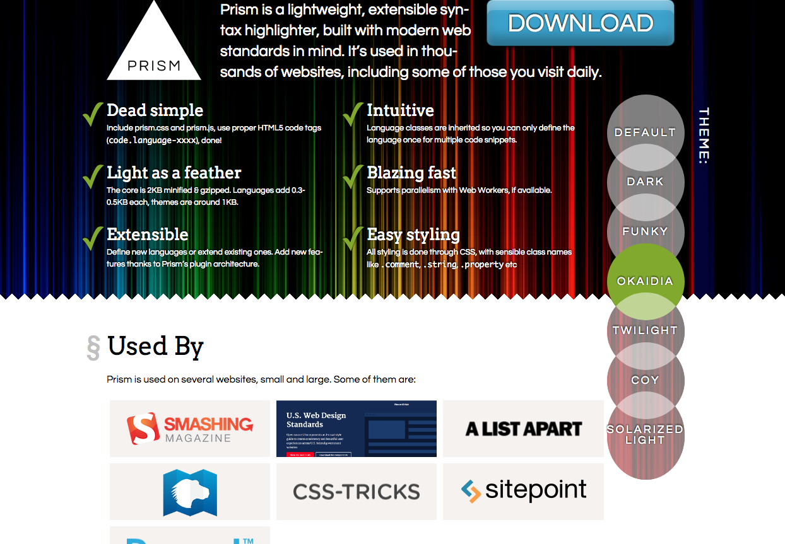
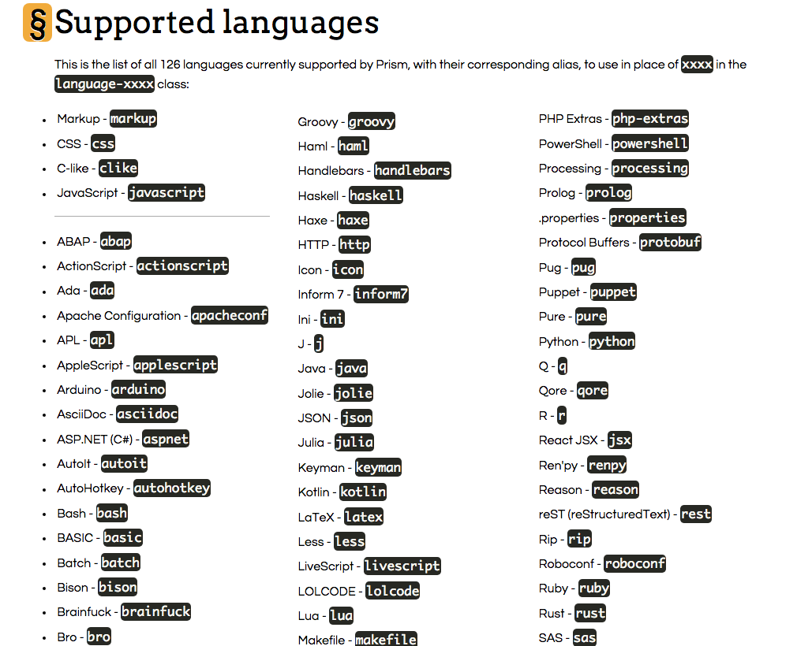
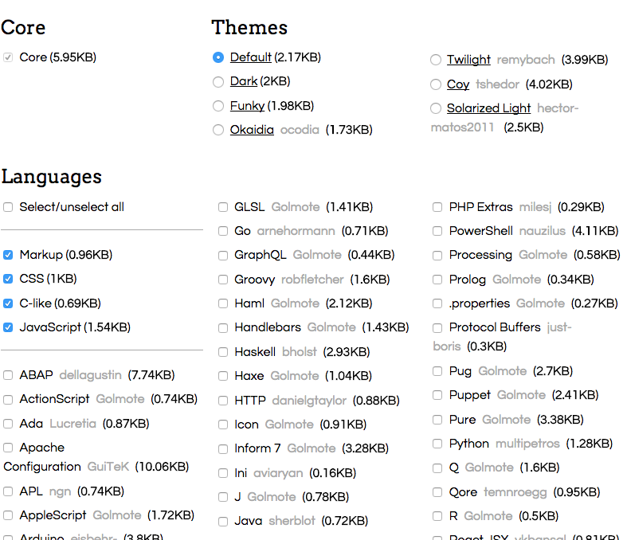

Ghost的code block沒有內建syntax highlighting，讓人覺得少了一味，所以來安裝[Prism](http://prismjs.com/)來加點顏色。  




*   Prism 預設有 7種樣板可以選，可以點選右側的theme來預覽。
*   幾乎所有的程式語言都有包含，可查看支援的[語言列表](http://prismjs.com/#languages-list)
*   還有一些蠻神奇的好用[pluging](http://prismjs.com/#plugins)

# 安裝筆記

1.  到http://prismjs.com/download.html ，幾乎就是購物車，選擇你要的theme、**語言**和**plugin**。  
    
2.  選完後，到最下面**DOWNLOAD JS** / **DOWNLOAD CSS** ，下載`prism.js`和`prism.css`
3.  把`prism.css`丟到 `ghost/content/themes/你的theme/assets/css`
4.  把`prism.js`丟到`ghost/content/themes/casper/assets/js`
5.  在theme的路徑下編輯`default.hbs`  
    在上面加入css檔

```html
    <link rel="stylesheet" type="text/css" href="{{asset "css/prism.css"}}" />
```

在最下面引入js檔

```html
    <script type="text/javascript" src="{{asset "js/prism.js"}}"></script>
```

6.在ghost根資料夾下，重啟ghost `$ ghost restart`，或者`ghost stop`後`ghost start`  
7.完成！