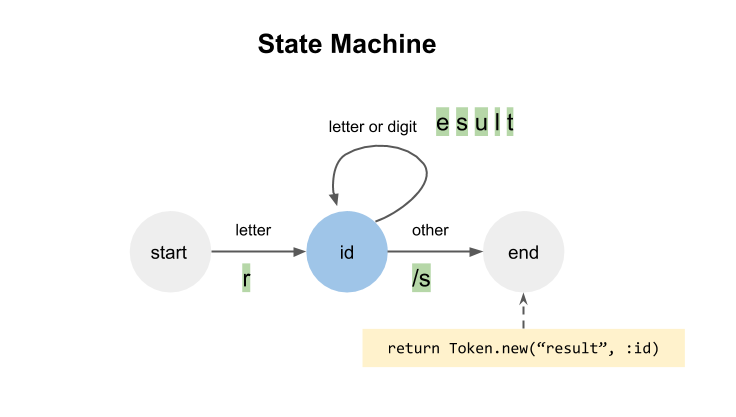
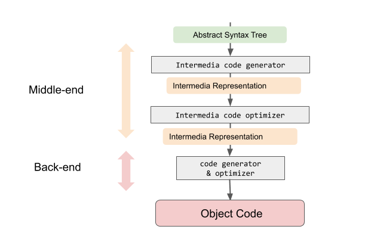

書到用時方恨少，大學念的東西全部都還給教授了，然後我都忘了到底又沒有修過 Compiler ... 去年看到了有位好心大大做了一個 [Compiler 入門筆記](https://docs.google.com/presentation/d/1lIgmkcEgne5k4XDYbHhusCM39Mh1m6rp4ddv8tIIVEg/edit#slide=id.p)的 slide，在書籤中塵封了好久，這陣子正好忙完一波加上放棄了鐵人賽，搭配著去年 c9s 在 Ruby conf tw 分享的 [Vitral Machines](https://www.youtube.com/watch?v=x6FrRQMF5tg) 主題反覆看了好幾天，趕緊趁還沒忘記做一個初淺的筆記整理。

# 先用 GCC 來演釋一下 c 語言的編譯流程

> 註 [GCC](https://zh.wikipedia.org/wiki/GCC) 全名是 GNU 編譯套裝( GNU Compiler Collection )，是許多 \*nix 系統如 Linux 或 BSD 官方的編譯器。起初 GCC 只能編譯 C 語言，後來也可支援 C++ 等多種語言。  
> GNU tool chain: GNU 編譯器中從 編譯/組譯/連結的一整套工具，基本上 `gcc` 指令可以完成一整套的工作

一個 c 語言從原始碼到編譯成執行檔需要經過以下的階段：


簡單的介紹 GNU tool chain 每個階段做的事情

*   **Preporcessor**: 預處理器，就是處理那些開頭有 `#` 的東西，例如 `#include` `#if` `#define`，把這些東西預先展開或者移除掉，詳情可以看 wiki [C 預處理器](https://zh.wikipedia.org/wiki/C%E9%A2%84%E5%A4%84%E7%90%86%E5%99%A8)。基本上預處理器比較沒那麼重要（難）。
*   **Compiler**: 一般不精確的來說 Compiler 是產生目標碼，在這裡你可以說 gcc 中 Compiler 轉出的目標碼就是組合語言（但對於整個 gcc 編譯生命週期來說機器碼才是目標碼，這裡應該只是個定義問題，不要太糾結）。 Compiler 一般來說會處理一些事情，分成前中後端，後面會再說明。
*   **Assembler**: 組譯器，其實就是把組合語言編譯成機器語言，變成機器看得懂的機械碼。
    *   你也可以說這是一種編譯行為，但習慣上我們會直接把組合語言的編譯行為叫做「組譯」。
    *   舉例：組合語言`MOV AH 09` 轉為 機械碼`00010010`。因為組合語言比較貼近機械碼的結構，只是說他換成人比較可以理解的英文字。
    *   如果我們把機械碼翻譯成組合語言，這個行為就叫做「反組譯」（ Disassembly ）。
*   **Linker**: 連結器。光有這個 source code 轉成的目標碼還不夠，還必須把它引用的 library 使用 linker 把他們打包再一起，最終產生出一個可以執行的執行檔（Executable）。
*   **Executable**: 執行檔
    *   基本上就是已經是人類無法看懂的機器碼，也被稱作「原生碼 Natvie Code」，是 CPU 可以直接解讀的資料。
    *   因為不同 CPU 會使用不同的指令集，所以可以執行的 native code 也不一樣。關於指令集的詳情可以參考 [wiki 的解釋](https://zh.wikipedia.org/wiki/%E6%8C%87%E4%BB%A4%E9%9B%86%E6%9E%B6%E6%A7%8B)。

> 關於 GNU toolchain 的一些細節，可以參考[這裡](https://hackmd.io/@sysprog/c-compiler-optimization?type=view#GNU-Toolchain)

為什麼不從 c 語言直接變成機械碼呢，jserv 老師在你所不知道的跟上面同篇的 c 語言編譯器講座中的[Frome Sorce to Binary](https://hackmd.io/@sysprog/c-compiler-optimization?type=view#From-Source-to-Binary-How-A-Compiler-Works-GNU-Toolchain)有提出了一個歷史緣由解釋：

> > 回到編譯器的設計，由於早期硬體限制很多，其實是不可能直接實做出高階語言的編譯器，相反的，早期的工程人員必須漸進地開發相關的工具的程式，所以你可以想像最早人們用機械碼拼湊出簡單的 assembler，然後在這之上發展了簡單的 C compiler，之後再用這個 C compiler 開發出更完整的 C compiler，後者可以編譯更完整的 C 語言程式，然後逐步延展下去。

* * *

為了讓上面的說明更有感覺，可以在自己的電腦上試著用 gcc 執行下面的範例：

一段 c 的範例程式

```c
int main(){
  return 100;
}
```

直接編譯成執行檔後執行一次，用 `echo $?` 來查看一次的執行結果

```shell
$ gcc test.c -o test
# 將 test.c 編譯成 test 執行檔
$ ./test
# 執行編譯後的 test 檔案
$ echo $?
100
```

最後編譯出來的 `test` 就是 executable（執行檔啦）。

gcc 也可以讓你下一些 option 去單獨產出個階段的結果：

不要連結，產生 `.o` 檔

```shell
$ gcc test.c -c
# 產生 test.o
```

不要組譯，產生 `.s` 檔

```shell
$ gcc test.c -S
# 產生 test.s
```

在這裡我們可以去偷看一下 `test.s` 就知道組合語言的檔案長得怎樣

```c
	.section	__TEXT,__text,regular,pure_instructions
	.build_version macos, 10, 15	sdk_version 10, 15, 4
	.globl	_main                   ## -- Begin function main
	.p2align	4, 0x90
_main:                                  ## @main
	.cfi_startproc
## %bb.0:
	pushq	%rbp
	.cfi_def_cfa_offset 16
	.cfi_offset %rbp, -16
	movq	%rsp, %rbp
	.cfi_def_cfa_register %rbp
	movl	$0, -4(%rbp)
	movl	$100, %eax
	popq	%rbp
	retq
	.cfi_endproc
                                        ## -- End function

.subsections_via_symbols
```

印出 preprocessor 預處理過後的檔案

```c
$ gcc test.c -E
# 1 "test.c"
# 1 "<built-in>" 1
# 1 "<built-in>" 3
# 363 "<built-in>" 3
# 1 "<command line>" 1
# 1 "<built-in>" 2
# 1 "test.c" 2
int main(){
  return 100;
}
```

## gcc 小結

給這上面這堆資訊歸納一下重點：

*   C 程式碼到變成執行檔總共會經過三大步驟
    *   編譯
    *   組譯
    *   連結
*   gcc 這個工具事實上不是 C Compiler，而是一個 Compiler Driver
    *   gcc 可以當 compiler, 也可以當 preprocessor, 也能當 assembler, 也可當 linker
    *   詳情可以看 [How A Compiler Works: GNU ToolChain](https://www.slideshare.net/jserv/how-a-compiler-works-gnu-toolchain) 的 15 頁

# Compiler 到底在做什麼

廣義的 Compiler ，其實就是把一種語言（source code）轉換成另一種語言（object code）的工具，只是說「通常」這個轉換的目標語言都會是比較低階的語言，可以給機器直接執行的：

*   例如前面講的 c compiler 編譯出的目標碼就是組合語，給實體機器執行。
*   Java Compiler (javac) 目標碼是 Java Byte Code，然後就可以在各個機器上的 Java 虛擬機器 JVM 執行。
*   WebAssembly 也是一種目標碼。例如目前已經有支援 C / C++ / Rust / Go 等語言的[編譯器](https://webassembly.org/getting-started/developers-guide/)編譯成 WebAssembly，然後在瀏覽器上面就可以執行 WebAssembly。(如果對 WebAssembly 還不太了解，可以參考[這系列的文章](https://codertw.com/%E7%A8%8B%E5%BC%8F%E8%AA%9E%E8%A8%80/648114/)）

## Source Code 到 Object Code 中間發生了什麼事情

請看下圖


簡單的說，Compiler 會分三個階段

1.  Front-end: 將程式碼切成一個一個的字，然後照該語言的邏輯變成一個抽象語法樹（Abstract Syntax Tree，簡稱 AST）。
2.  Middle-end: 將 AST 轉換成中間語言（Intermedia Representation 簡稱 IR），並且將這個 IR 優化
3.  Back-end: 將 IR 轉換成目標碼並且優化。

## Front-end

> 目標：從原始碼轉成 AST 抽象語法樹

主要有三個階段：**Lexer**、**Syntax Analyzer**、**Semantic Analyzer**


### Lexer

目標：把程式碼的字串切成一個個的 token。

說明：所有的語言都有一個「文法」。例如我們說一個英文的簡單句子是由「主詞(名詞)＋動詞＋受詞（名詞）」組成，當我們的語句不符合這個文法可能別人就聽不太懂，但是在 Lexer 的階段不是要處理文法，而是先想辦法把接收到的一堆字個別分出來並且標註「名詞」「動詞」「 介系詞」等等的。而 Lexer 會依據該語言的文法來定義 lexical grammer，例如數字、變數、保留字、運算符號等等的，把程式碼切成一個一個 token


方法：Lexical grammer 會定義這個語言的文法中每個字詞的規則，Lexer 會將程式碼將一個字一個字元讀出來，然後利用狀態機來辨識，最終產出 token，除了包含 token 本身的字串內容外，還會附帶他的字詞種類:



通常狀態機可以用 regular expression 取代，例如在 Ruby 中就有 `StringScanner` 可以依序讀入字串，並且可以搭配 regex 來判斷取出token，下面是一段隨便用 ruby 寫寫的 Lexer tokenizer ... 可以大概參考一下那種感覺：

```ruby
def tokenize(input)
  scanner = StringScanner.new(input)
  tokens = []
  while !sanner.eos
    when scanner.scan(/\d+/)
      tokens.push(Token.new(scanner.match.to_i, :number))
    when scaner.scan(/([A-Za-z])([A-Za-z]|\d|\_)/
      tokens.push(Token.new(scanner.match, :id))
    # ...
  end
```

### Syntax Analyer

目標：把 token 變成語法樹

說明：舉一個很爛的例子，如果英文基本結構是 「主詞 + 動詞 + 受詞」，而主詞可以往下展開為一個單一名詞，或者有個形容詞加上名詞的組合，而受詞可能還可以往下展開。例如 “I love her" 是個合文法的句子，而 "That guy wants to make a lot of money" 也是一個合法的句子，而語法樹就是用來表達一個語句的抽象結構。Syntax Analyer 又可稱之為 **Parser**，把 token 轉換為抽象語法樹。

以下的例子來說，`x + 12` 本身要先運算出結果來，才可以被 assign 給 `result` 這個變數，因此 parser 會轉成以下的樹狀結構：


方法：要產生出語法樹，該語言必須先定義好一個 **「上下文無關文法 Context Free Grammar」** (簡稱 CFG）。例如我們定義好一個語言規則 `A -> α`，則我們不需要考慮 `A` 的上下文是在什麼情況下，都可以被替換成 `α`，而幾乎所有的程式語言都是使用 CFG 來定義他的文法邏輯。

最常見的 CFG 是 [Backus Normal Form](https://zh.wikipedia.org/wiki/%E5%B7%B4%E7%A7%91%E6%96%AF%E8%8C%83%E5%BC%8F)（簡稱 BNF），以下是用 BNF 的擴展形式 EBNF 定義的簡單語法：


定義了語法之後，我們可以拿這個文法來實作真正的 parser 程式碼。  
parse 的方式有兩種：

1.  Top down parser : 也稱為 LL parser (Left to right, Leftmost derivation)，以遞迴的方式，依序從第一個 token 開始，根據 CGF 文法建立 tree。通常比較好懂，但實際上編譯器實作比較不會用這個方式，而且文法就要避免有出現 infinite recursion 這樣的定義出現。
2.  Buttom up parse：也稱為 [LR parser](https://zh.wikipedia.org/wiki/LR%E5%89%96%E6%9E%90%E5%99%A8) ( Left to right, Rightmost derivation)，使用了堆疊和 shift reduce 的方式，由下而上的建立起語法樹，通常這類的 parser 都是由 parser generator 自動的產出程式碼，而且比 LR parser 更加的強大，可以支援更廣泛的文法。

到這邊看不太懂沒關係，總之就是把樹建起來的過程。而通常在現代 parser generator 的技術都很成熟了，只要把 CFG 定義好丟給 parser generator 就可以產生 parser 了。例如 Bash、Go、ZendEngine(php)、CRuby 使用的是 **Bison**，而 Java 和 Groovy 使用 **ANTLR**。

如果對於 Parser 使用 LL 或 LR 兩種方式轉換與法樹的過程有興趣，推薦可以看一下 SoManyHs 的 [RubyConf 2015 - Time flies like an arrow; Fruit flies like a banana..](https://www.youtube.com/watch?v=lCtzFWAPDP4) 這段演講，其中很詳盡的解說 Lexer 到 Parser 的這段過程。

### Semantic Analyzer

當我們有樹了之後，Compiler 還會做語意分析。除了語法在 parser 階段可以確認是符合文法以外，還要必須根據上下文來判斷是否合乎該語言的語意。例如說某些語言使用變數必須事先宣告、不允同樣的 scope 重複宣告相同變數、不同的型別不能做某些處理（型別檢查）等等。例如 Ruby 這麼放縱自由的程式語言，可能就不太會有這些限制，但是 C 語言或 Java 就完全不是這麼一回事。

語意分系除了拿上一步驟產生的 Syntax tree 以外，還會藉由一個 **Symbol table** 來做檢查。Symbol table 可以在 lexer 或 parser 階段建立起來，看語言本身的實作，簡單的說他的功能就是紀錄每一個 scope 裡面宣告了那些變數，記錄它的型別是什麼，因此可以作為供語意分析器判斷程式碼是否合法的依據。

  
(source: [Compiler Design - Symbol Table](https://www.tutorialspoint.com/compiler_design/compiler_design_symbol_table.htm))

> 前端功能小結：經過了一陣努力，我們寫的原始碼被切成了 token，最終轉換成一個抽象語法樹（AST）

## Interperter 直譯器

這邊插播一下，有種東西叫做**直譯器**，Ruby、Python 和 PHP 早期也都是直譯器。  
直譯器原理就是不像一般 comipler 會先編譯成一個 object code，而是在前端產出 AST 之後，直接走訪整個樹來執行程式碼。

  
(source: [https://ruslanspivak.com/lsbasi-part7/](https://ruslanspivak.com/lsbasi-part7/))

有興趣可以參考這系列文章 [Let’s Build A Simple Interpreter](https://ruslanspivak.com/lsbasi-part1/)，教你怎麼手把手建一個 Interpreter。

## Middle-end 和 Back-end

Middle-end 吃 AST，使用 code generator 產生中間表達式 Intermedia Representation（簡稱 IR）  
Back-end 吃 IR，最後產生 Object code。



當初在這邊心中有冒出一些疑惑，花了一點時間才弄懂：

> 問：「為什麼需要先轉為 IR 優化後才轉為 Object Code？」

請以下看這張圖

  
(source: [Princeton CS320 Intermediate Representation lecture notes](https://www.cs.princeton.edu/courses/archive/spr03/cs320/notes/IR-trans1.pdf))

如果沒有 IR，直接從 Front-end 編譯到各個機器平台的話，因為對應平台的機器目的碼都不同，這樣會有太多種的組合，以實作來說就是一個悲劇。而 IR 通常都是不相依於機器的，因此這樣更易於重用，提高開發彈性。所以依我的理解，IR 並非必要，如果你最終目標碼只是個像是 WebAssembly 這種不相依於平台的語言，那 Middle-end 和 Back-end 可以視為同個階段就好。

> 問：「都是 code generator，那一定要有 Back-end 嗎？」

這個問提就回到前面在講廣義 compiler 定義的問題了，如果我們的目的碼不是需要變成更低階的語言，那麼其實拿到 AST 直接過 code generator 來產出目標碼是可以的。例如在 Java 裡面的目標碼稱之為 Java ByteCode，這個 byte code 你可以說是一個 IR，也可以說是 Javac 的 Object code，總之就是看最終希望 Compiler 本身需要實作的目的，並不是一定需要 Middle-end 和 Back-end 都要實作，這裡說明的 Back-end 就我的理解，應該像是 gcc 這種需要編譯到機械碼的架構上才有的設計。

## Virtual Machine 又是什麼？

JVM、CRuby 的 yarv、php 的 ZendEngine 都是 VM (虛擬機器Virtual Machine)，那 VM 又是什麼東西？  
以這種程式語言的虛擬機器來說，就是為了要模擬一個實體機器的運作。實體機器會有不同的指令集，而虛擬機器也是，只是這種指令集我們會稱之為 Bytecode，也就是上面 compiler 說明的時候講的 IR。比起直譯器，使用虛擬機器的好處是，可以根據轉換出來的 Bytecode 做優化，執行效率來說會比直譯器直接去執行 AST 來的快。

> 問：「那 VM 又是怎麼弄出來的？最終不是還是要在實體機器上執行嗎」

這個問題也是讓我卡了好一陣子，後來看到公司的蒼時最近在[自幹一個 MRuby 的 VM](https://ithelp.ithome.com.tw/articles/10236703)後才恍然大悟 - VM 本身就是用 C 寫的啊！也就是說我們可以用 C 語言寫出一段程式碼，去解讀我們自己定義的一種 Bytecode 形式，然後讀取那些 Bytecode 進而直接在機器上執行，也就是說最終處理的還是 C 這種比較底層的語言。

### 各種語言 VM 的 Bytecode 結構上有什麼不同之處

Bytecode 主要有兩種結構：

**Register Based**  
這種 bytecode 比較像是處理器在操作暫存器（register）運算的方式，會有兩個運算元和一個運算子，運算元可以先放在暫存器內，然後再依據運算子做對應的處理。因為這種結構比較貼近當代的 cpu 架構，所以也可以對 register 的利用做一些優化。PHP 的虛擬機 Zend Engine 和 Andriod 上執行 Java 的虛擬機 Dalvik 都是用 register based。

以下為 Zend Engine 的 bytecode

```
<?php
  $hi = 'hello';
  echo $hi;
?>

opnum     line               opcode         op1        op2      result
    0        2         ZEND_FETCH_W        "hi"                     '0
    1        2          ZEND_ASSIGN          '0    "hello"          '0
    2        3         ZEND_FETCH_R        "hi"                     '2
    3        3            ZEND_ECHO          '2
    4        5          ZEND_RETURN           1
```

**Stack Based**  
這種 byte code 的結構指令比較短，然後是用堆疊的方式處理指令。例如 Ruby 的 yarv 和 Java 的 jvm 都是這種結構。

以 Ruby 為例，因為編譯過的 bytecode 就直接在記憶體裡面執行了，所以如果要印出來必須要用 `InstructionSequence.compile` 過後呼叫 `disasm` 反組譯出來：

```
irb(main):004:0> puts RubyVM::InstructionSequence.compile('x=1;  x + 4').disasm
== disasm: #<ISeq:<compiled>@<compiled>:1 (1,0)-(1,11)> (catch: FALSE)
local table (size: 1, argc: 0 [opts: 0, rest: -1, post: 0, block: -1, kw: -1@-1, kwrest: -1])

[ 1] x@0
0000 putobject_INT2FIX_1_                                             (   1)[Li]
0001 setlocal_WC_0                x@0
0003 getlocal_WC_0                x@0
0005 putobject                    4
0007 opt_plus                     <callinfo!mid:+, argc:1, ARGS_SIMPLE>, <callcache>
0010 leave
```

* * *

# 後記

如果你是第一次嘗試了解 compiler 又讀到這裡，相信已經非常頭痛，本來還想要寫一點 Ruby yarv 虛擬機的一些研究筆記，不過這樣下去這篇文章應該還會多個兩三倍的量...。這陣子研究編譯器相關的知識，雖然只是皮毛，不過了解了大概程式語言編譯的概觀，至少不是霧裡看花，往後在追各種語言的原始碼也大概比較好下手。

以下是寫這篇過程參考的資料，附上一些簡單的摘要和心得。

影片

*   [(影) Virtual Machines: their common parts and what makes them special](https://www.youtube.com/watch?v=x6FrRQMF5tg): c9s 於 2019 Ruby conf tw 的演講，介紹 Compiler 歷史、原理，以及探討各個語言 VM 的實作，為了要把它看懂也是我寫這篇網誌的初衷。
*   [(影)Time flies like an arrow; Fruit flies like a banana..](https://www.youtube.com/watch?v=lCtzFWAPDP4): SoManyHs 於 2015 Ruby conf San Antonio 的演講，主要在講編譯器前端處理的過程，簡報很詳盡，懶得看書可以看這個。
*   [(影)Inside Ruby's VM: The TMI Edition](https://www.youtube.com/watch?v=CT8JSJkymZM): Aaron Patterson 於 2015 Ruby conf San Antonio 的演講，主要是分享他在爬 yarv 原始碼的過程，感覺上後面有點失控，建議還是先看 c9s 的演講後再來看這部。

書

*   [Compilers - Principles, Techniques, and Tools](https://www.tenlong.com.tw/products/9789861549361): 資工系 compiler 經典教材龍書...我在這個月看(進去)的量大概是比大學還要多。
*   [Language Implementation Patterns](https://pragprog.com/titles/tpdsl/language-implementation-patterns/): 如何自製一個語言，算是比較不那麼理論的書。c9s 在 ruby conf tw 的演講裡推薦的書籍，據他說這本很簡單一天就可以看完(???????

文章或投影片

*   [Compiler 入門筆記 - 搞懂編譯器在做些什麼](https://docs.google.com/presentation/d/1lIgmkcEgne5k4XDYbHhusCM39Mh1m6rp4ddv8tIIVEg/edit#slide=id.p)：臉書上看到有人分享覺得做的很淺白的投影片，推薦入門第一篇就是它。
*   [編譯器和最佳化原理篇](https://hackmd.io/@sysprog/c-compiler-optimization?type=view#GNU-Toolchain)：jserv 老師「你所不知道的 C 語言系列講座」其中之一，裡面介紹了 comilper 的一些歷史和 GNU Toolchain 的簡介，裡面還有講座錄影。
*   [從原始碼到二進制](https://www.slideshare.net/jserv/how-a-compiler-works-gnu-toolchain)：jserv 老師的簡報，主要介紹 C 語言從原始碼到二進制機器碼的過程，深入淺出，86 頁投影片紮實不灌水。
*   [C 編譯器入門～想從低階系統從自幹編譯器開始](https://koshizuow.gitbook.io/compilerbook/) ：電子書，用 C 來實作個低階編譯器，也就是最終是編成組合語言，很淺顯易懂，不會寫 C 也能慢慢理解他想表達的知識，超推。
*   [寫一個送禮自用兩相宜的 compiler](https://speakerdeck.com/elct9620/taipei-dot-rb-xie-ge-song-li-zi-yong-liang-xiang-yi-de-compiler): 公司同事蒼時的簡報，利用 Ruby 時做一個簡單的編譯器，深入淺出值得參考。
*   [Ruby Interpreters: What You Need to Know](https://scoutapm.com/blog/ruby-interpreters-what-you-need-to-know)：簡單介紹 compiler 與 interpreter 的不同，另外還有對不同版本的 ruby 做簡單的介紹。
*   [Creating a Virtual Machine/Register VM in C](https://en.wikibooks.org/wiki/Creating_a_Virtual_Machine/Register_VM_in_C)：直接教你怎麼用 C 寫一個 register based 的 vm，很硬的文章。
*   [C/C++ 靜態連結庫(.a) 與 動態連結庫(.so)](https://www.itread01.com/content/1547725521.html): （很不想轉內容農場的文章但找不太到出處）主要是介紹 c/c++ 做靜態/動態鏈結的原理。
*   [Stack based vs Register based Virtual Machine Architecture](https://developer.aliyun.com/article/55902): 簡單介紹 Stack based bytecode 和 register based 的差別，文章不長，簡體中文，前面對於 bytecode 說明不夠了解的話可以看這篇。
*   [深入淺出 hello world](http://blog.linux.org.tw/~jserv/archives/001844.html): jserv 老師很早期的投影片，就是個超展開的主題，從 compiler 到執行期間的原理、作業系統等等。原文的投影片簡報連結已經失效，不過利用這個關鍵字在網路上搜尋一下還是可以找得到。
*   [Ruby 2.x 源代码学习：语法分析 & 中间代码生成 之 数据结构](https://segmentfault.com/a/1190000008213582): 可以搭配上面 Aaron Patterson 的演講服用，主要是 trace cRuby 原始碼的筆記，可以幫助理解 yarv 的實作。
*   [深入淺出教你寫編譯器（Compiler）系列文章](http://inspiregate.com/programming/other/471-compiler-1.html): 這種深入淺出繁中的系列文章不多各位要珍惜啊！建議可以搭配龍書閱讀。