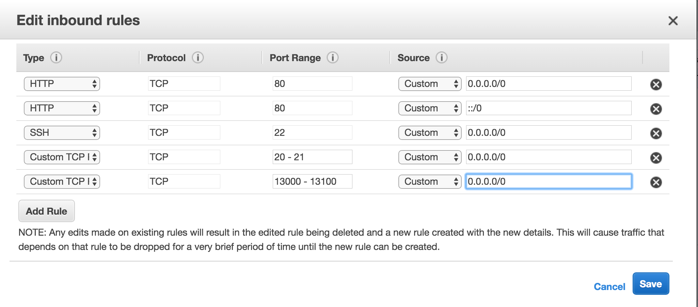

說要開始寫blog說了好久，本來想在[wordpress.com](https://zh-tw.wordpress.com/)下手，但是免費版的會出現廣告，付費版又有客製化限制。後來工作關係開始接觸自架[wordpress](http://www.wordpress.org)，theme的修改和plugin也研究的差不多(花了好多時間)，正當著手建站之際正好就看到了[Ghost](https://ghost.org/)這個blog系統，簡潔的版面讓愛慕虛榮務實的我一眼就愛上，花了幾天研究一下就決定是他了！  


歸納了一些我選擇的原因：

*   美：不管前後台都美，支援RWD，預設的theme就已經很漂亮。
*   發文預設支援[markdown](https://help.ghost.org/hc/en-us/articles/224410728-Markdown-Guide)：markdown上手的話真的很方便。
*   使用node.js：對於應付大量請求效能更好，雖然目前本站根本沒啥請求...
*   簡潔：wordpress雖然有很多套件可以兜，不過單純寫blog不太需要那麼多功能，整體操作體驗和[Medium](http://medium.com)很像。
*   安裝快速：雖然各大空間主機都有支援wordpress免安裝懶人包，但是從頭裝到尾的程序上ghost還是簡便很多。
*   簡單的來說，wordpress強大，ghost單純。

藉由這次機會也順便申請了AWS EC2免費一年的主機來玩玩看，分享一下安裝心得

# Ghost (v1.6.1) 環境需求

* * *

*   ubuntu 16.04
*   MySQL
*   NGINX
*   Systemd
*   Node v6 installed via NodeSource
*   At least 1GB memory (swap can be used)
*   A non-root user for running ghost commands

# AWS ec2主機建立

* * *

AWS提供[一年免費的服務](https://aws.amazon.com/tw/free/?sc_channel=PS&sc_campaign=acquisition_TW&sc_publisher=google&sc_medium=tcn_cloud_computing_b&sc_content=aws_free_e&sc_detail=aws%E5%85%8D%E8%B2%BB&sc_category=cloud_computing&sc_segment=162510310978&sc_matchtype=e&sc_country=TW&s_kwcid=AL!4422!3!162510310978!e!!g!!aws%E5%85%8D%E8%B2%BB&ef_id=V0W4awAABbde7j66:20170813152434:s)，其中ec2可使用[t2.micro](https://aws.amazon.com/tw/ec2/instance-types/)的規格750小時，並且可使用30GB的EBS空間。  
1.註冊完AWS帳號登入後，右側的地區記得選Tokyo  
2.SERVCIE > EC2 >Instance > Lunch Instance  
3.挑選**Amazon Machine Image**：這裡可以選兩種方式，最快的是到**AWS Marketplace**找到**bitnami打包的ghost**，馬上可建站；或者是在**Quick Start**挑選**Ubuntu Server 16.04LTS**，自己從頭安裝。兩種我都試過了，從頭安裝其實不會太麻煩。  
4.接下來步驟可參考AWS上的[啟動Linux機器10分鐘教學](https://aws.amazon.com/tw/getting-started/tutorials/launch-a-virtual-machine/)，主機要選擇**t2.micro**，另外在選擇Key Pair的地方要注意一定要選擇**創建新的key**或者原本在ec2主控台的**Key Pairs**下自行建立的key，預設ssh連線主機都使用金鑰連線。創建好的private key不要亂丟要收好。  
  
5.依照上面的步驟完成主機建置，我們這裡選擇ubuntu16.4主機的預設登入user id是_ubuntu_

# Ghost安裝

* * *

以下步驟參照[ghost官方production環境建置](https://docs.ghost.org/docs/install)。

### Create User

創建自己想要的帳號，如果想要用預設的id _ubuntu_，那這部分可以略過

```
$ adduser <user>
```

### 賦予sudo權限

```
$ usermod -aG sudo <user>
$ su - <user>     //登入user下繼續其他操作
```

### 更新ubuntu內的package

應該是使用apt-get之前的好習慣

```
$ sudo apt-get update
$ sudo apt-get upgrade
```

### 安裝Nginx

```
$ sudo apt-get install nginx
```

如果主機ufw防火牆有開啟，要允許nginx服務通過，可以使用`ufw status`查詢是否啟動，但這裡我就直接在ec2上的Security Groups設定安防火牆，不想使用ufw的可跳過

```
$ sudo ufw allow 'Nginx Full'
```

### 安裝mysql

輸入以下指令後並依照指引設定root的密碼

```
$ sudo apt-get install mysql-server
```

### 安裝node.js

先將node 6的apt repository匯入後再安裝

```
$ curl -sL https://deb.nodesource.com/setup_6.x | sudo -E bash 
$ sudo apt-get install nodejs
```

### 安裝ghost

在`var/www/`下建立ghost資料夾，執行`ghost install`

```
$ mkdir /var/www/ghost
$ cd /var/www/ghost
$ ghost install
```

這裡就會發現ghost超貼心，除了安裝程式外，還可以幫你把mysql、nginx設定檔全部搞定！

# 其他設定

* * *

### 資料夾權限設定

我自己的習慣是建立一個群組，把_user_和web server使用的_www-data_加入，ghost本身會產生一個id 叫_ghost_，也可以ㄧ併加入。

```
$ sudo groupadd -r webgroup
$ sudo usermod -a -G webgroup <user>
$ sudo usermod -a -G webagroup www-data
$ sudo usermod -a -G webgroup ghost
```

接下來把`/var/www/ghost`資料夾權限id:group設定為_user_:webadmin

```
$sudo chown -R <user>:webgroup /var/www/ghost/
$sudo chmod -R 775 /var/www/ghost/
```

### vsftpd設定

安裝vsftpd

```
$sudo apt-gate install vsftpd
```

修改vsftpd設定檔

```
$sudo cp /etc/vsftpd.conf /etc/vsftpd.conf.backup
$sudo vi /etc/vsftpd.conf
```

將設定調整為以下，如果裡面沒有的要自己加上去

```
# Uncomment this to enable any form of FTP write command.
write_enable=YES
# Uncomment this to allow local users to log in.
local_enable=YES

#以下自己新增的，將ftp設定為passive mode
pasv_enable=YES
pasv_min_port=13000
pasv_max_port=13100
port_enable=YES
pasv_address=[public dns from the amazon EC2 instance]
pasv_addr_resolve=YES
```

這裡設定為passive mode的原因，主要是因為ftp溝通和傳輸通常是不同port。  
active mode ftp 來說，client端發送請求到`port 21`，server端則由`port 20`發起傳送data的請求，這種情況如果在client端有防火牆的狀況，就有可能不會通，而passive mode可以解決這個問題，詳細可參考[主動式與被動式FTP比較](https://phorum.com.tw/ShowPost/5609.aspx)。

### 防火牆設定

回到aws ec2的控制台，**NETWORK & SECURITY** > **Security Groups** 下，找到這台ec2主機所套用安全規定的group id(或是去**Instance**裡面找)，設定inbound role，把80、20、21、passivemode的那些port打開：  
  
完成後應該就可以開心地使用了。  
記得如果使用ftp，模式要記得改為passive被動模式。