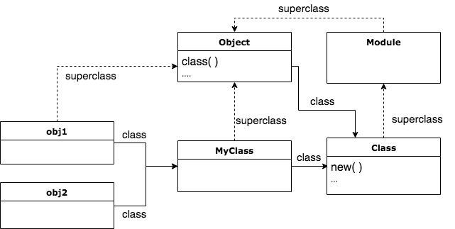
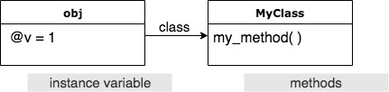
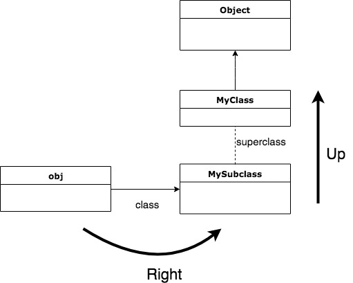

又來開新副本了，經過朋友推薦看了這本 [Metaprogramming Ruby 2](https://pragprog.com/book/ppmetr2/metaprogramming-ruby-2) 之後覺得 Ruby 真的是很神奇的語言，也了解了 Ruby 為什麼適合做一個 DSL ，推薦要撰寫 ruby 的朋友一定要閱讀這本書，雖然不見得會用到這些技巧，但是會了解 Ruby 與 C++ JAVA 這些物件導向語言的最大不同之處以及 Ruby 強大的地方。

# open class

在 Ruby 中重複定義 class，會將把裡面的 method 加上去，因此再次宣告 class 的定義就像是把 class 重新「打開」一次。

```ruby
class D
  def x;'x';end
end
class D
  def y;'y';end
end

obj= D.new
obj.x # => 'x'
obj.y # => 'y'
```

所以可以透過這個特性，我們可以將 Ruby 原生的 class 擴充功能。

## open class 的問題

有可能會修改到相同名字的 method，因此也稱為 _Monkeypath_  
可以先確認是否有相同名字的 method

```ruby
obj.method.grep(regexp..)
```

或者是使用 **Refinements** 的方式，在需要的時候再去使用它

```ruby
module StringExtensions
  refine String do 
    def to_alphanumeric
      gsub(/^|w|s/,'')
    end
  end
end
module StringStuff
  using StringExtensions
  "my_string123".to_alphanumeric
end
```

以上面為例，其中 `StringExtensions` 的作用域只有在 `module StringStuff` 裡面，因此不會影響到其他的程式碼

## instance variable 產生的時間

`object.instance_variables`：可以查看 object 內的實例變數(`@`開頭的)  
Ruby 是動態型別，所以有可能會因為還沒執行到那一段instance variable assignment 的 method ，造成相同**Class 的 Object 會有不同的 instance variable**

```ruby
class MyClass
  def my_method
    @v = 1
  end
end
obj = MyClass.new
obj.class  # MyClass
obj.instance_variables
# => []
obj.my_method
# => 1
obj.instance_variables
# => [:@v]
```

會有這種特性其實也跟 instance variable 存在的位置有很大的關係：在 Ruby 裡面，**實例變數是放在實例物件裡面**，但**方法卻是放在類別裡面**。

# Class 和 Module

```rb
"hello".class # String
String.class # Class
```

靜態語言的 class 只是個 read only 的描述，ruby 的 class 是一個 Class 類別實例化的個物件。所以你可以在 run time 的時候使用 `Class.new` 來動態的產生新的類別  
屬於**Class** 自己的 methods: `allocate`, `new`, `superclass`

而 Class 的 super class 是 module

```rb
Class.superclass  # Module
```

class 和 module 幾乎是一樣的，差別就在使用時機：

*   使用 Module 是為了 include 某些功能
*   宣告 Class 是為了要繼承/實例化使用

## 物件的兩條線

在 ruby 的世界中，一個物件會有兩條線：

*   一個是他繼承自哪裡 superclass
*   一個是他的類別 class

```ruby
class MyClass
  def my_method
    @v = 1
  end
end
obj = MyClass.new
obj.class  # MyClass
obj.superclass # Object

MyClass.class  # Class
MyClass.superclass  # Object

Class.class  # Class
Class.superclass # Module

Object.class # Class
Object.superclass # BasicObject
```

因此以下的範例來說

```ruby
class MyClass; end
obj1 = MyClass.new
obj2 = MyClass.new
```

可以將 superclass 和 class 的關係圖畫成下面的樣子



## 關於 object 和 class 的二三事

（這裡的 object 指的是從一個類別實例化之後的東西，不是指 Object 這個 class）

*   **objects**: 上面存有他的instance variable，加上一個到 class 的連結（這個 Object 是哪個 class)。物件本身的 method 不存物件上，而是存在它的 class 上（instance methods）
*   **classes**: 類別本身就是 Class 這個類別的實例物件，例如我定義 MyClass 這個類別時，本身也是將 Class 這個類別實例化。這個 Class 的實例化物件，帶著一坨實例變數，然後連結到 **superclass** 。Class 這個類別的 superclass 是 Module ，所以 Class 本身也是一種 module。 類別本身有 instance method ，也有自己的 method，像是 `new`。取用 class name 本身就是一種常數，而常數本身是一種「類似檔案系統的樹狀結構」，所以 class name 和 namespace 是息息相關的
*   如果 module 和 class 重複定義相同的名字，會以 module 為主
*   module 可以用來規劃 namespace

# Constant 常數

Ruby 的常數是可以修改的，跟一般變數的差別就在 scope  
取用的方法有點像 file system 一樣，階層式的方式來存取

```ruby
module M
  class C
    X = 'a constant'
  end
  C::X # "a constant"
end
M::C::X # "a constant"
```

也可以指向 root

```ruby
Y = "root const"
module M
  ::Y # "root const"
end
```

常數要注意的事：

*   使用 `constants` 方法可以回傳 class/module 裡面所有的常數  
    _Module.constants_ 回傳最高層的常數
*   對於 Ruby 來說，class name 如`Object`, `Module` 都算是常數變數
*   使用 `Module` 可以幫我們組織 constant（像是 file system 的資料夾）

# Method

使用 `obj.methods` 來查詢物件可使用的方法。因為有可是繼承 superclass，可以搭配 `grep` 來尋找需要的 method

```ruby
class MyClass
  def my_method
    @v = 1
  end
end

obj.methods.grep(/my/) # 用 regexp
```

而可以被實例化 obj 使用的 method，又叫做「**instance method**」。instance method 一定要使用實例化的物件才可以呼叫他。  
class 所包含的 method 還有包括 Class method，所以你會發現 obj 可以用的 method 和 class 本身的 method 是不同的

```rb
String.instance_methods == "abc".methods # true
String.methods == "abc".methods # false
```

雖然 instance method 只有實例物件 obj 可以去使用它，但在實例物件 obj 上只會存放instance variable，而 instance method 其實是放在 class 上面的：



關於 instance method 要注意的是：

*   class 自己的 methods 不等於實例化的 object 所擁有的 methods(class 自己的 methods 比較多)
*   `String.instance_methods(false)` 帶入 false 參數代表忽略繼承的 class

## Method 的呼叫

呼叫 mehtod的時候, Ruby 會先處理兩件事：

1.  在繼承串列( ancestors chain )中尋找 method 在哪裡。因為 method 放在 class 內，會沿著繼承鍊去尋找 method 在哪個 class 上並且呼叫。沒有宣告 superclass 的類別，預設是繼承 Object。
2.  執行 method, 這邊需要知道 `self` 這個物件是誰.

呼叫 method其實是將 method 的名稱丟給一個接收者物件（receiver）去執行  
**receiver**: 呼叫 method 的那個物件。例如 `obj.meth_1`，則 **obj**  
就是 receiver 。

## receiver 和 self

呼叫 method 時，method 所在的位置物件

```ruby
my_string.reverse()
```

這時 `my_string` 就是 receiver 物件  
可以使用 `send` 方法，對 receiver 呼叫方法

```ruby
my_string.send(:reverse)
```

**self** 是一個特殊的物件，在 ruby 中的執行環境一定會存在一個 self 物件，稱之為 Current Object，如果不指定 reveiver，預設 receiver 就是 self

```ruby
class MyClass
  def testing_self
    @var = 10    # self 的 instance variable
    my_method()  # self.my_method()
  end
  
  def my_method
    @var = @var + 1 
  end
end

obj = MyClass.mew
obj.testing_self  # MyClass
```

而在 ruby 中 的 **private 定義**跟 c++ 不太一樣，不能定義**明確的 receiver**，即使你使用 self.method 也是不行的

```ruby
class C 
  def public_method
    self.private_method  # error, 不能定義 receiver
    private_method       # ok
    self.send :private_method # 但是使用 send 還是可以叫得到
  end
  
  private 
  def private_method; end
end
```

延伸閱讀： [Public, Protected and Private Method in Ruby](https://kaochenlong.com/2011/07/26/public-protected-and-private-method-in-ruby/)

## ancestors chain

繼承鍊的找尋順序，會先找到右邊的 class，再去往上找它們的 superclass

```ruby
class MyClass
  def my_method;
    "my_method()"
  end
end

class MySubclass < MyClass
end

obj = MySubclass.new
obj.my_method()
# 會一路找到 MyClass 
```



`class.ancestors` 可以呼叫出繼承鍊（包含 module）。

```ruby
MySubclass.ancestors # MySubclass, MyClass, Object, Kernal, BasicObject
```

### module 的繼承鍊

繼承鍊中會包含 module（例如上面的 **Kernal**），如果要把 module 加入繼承鍊中，在使用 `include` 可以加在自己的上面，使用 `prepend` 會加在自己的下面。