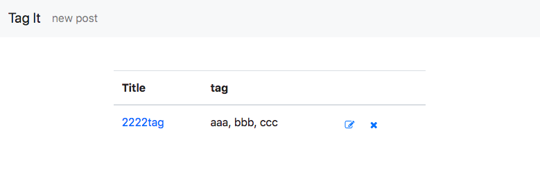

在 Rails 中果要實作 tag 的功能，目前網路上找到比較常見的做法是使用 [act as taggable on](https://github.com/mbleigh/acts-as-taggable-on) 這個 gem，不過這個 gem 似乎沒有維護的很好？於是參考了網路上的做法，自己在 Rail 上實作做了一個簡單的 tag 功能，本篇的範例實作以下項目：

*   每篇文章（**post**）可以加上多個標籤（**tag**）
*   編輯文章時，輸入不存在的 tag name，可以自動產生該 tag。
*   利用 **select 2** 這個 JavaScript 函式庫，來實作 tag 輸入欄位的前端美化及 auto complete 功能。

# 事前準備

本範例使用以下 gem

*   [bootstrap 4](https://github.com/twbs/bootstrap-rubygem) (包含 jquery-rails)
*   [simple form for](https://github.com/plataformatec/simple_form)
*   [font awesome rails](https://github.com/bokmann/font-awesome-rails)

接下來是文章的部分，其實就是很簡單的 CRUD，這裡就不特別說明。  
新增**Post model**：

```bash
$ rails g model post title:string content:text
$ rails db:migrate
```

新增**Post controller**：

```ruby
class PostsController < ApplicationController
  before_action :set_post, only: %i[edit update show destroy]
  def index
    @posts = Post.all
  end

  def show
  end

  def new
    @post = Post.new
  end

  def create
    @post = Post.new(post_params)
    if @post.save
      redirect_to post_path(@post)
    else
      render :new
    end
  end

  def edit
  end

  def update
    if @post.update(post_params)
      redirect_to post_path(@post)
    else
      render :edit
    end    
  end

  def destroy
    @post.destroy
    redirect_to root_path
  end

  private

  def post_params
    params.require(:post).permit(:title,:content)
  end

  def set_post
    @post = Post.find_by(id: params[:id])
    redirect_to root_path if @post.nil?
  end
end
```

_\[postscontroller.rb\]_

view 的部分可參考 [github](https://github.com/spreered/taggit/tree/bdb11657583d19497077f634f0820d79de9d14ea/app/views/posts)

# 新增 Tag model 和關聯

新增 **Tag Model**：

```bash
$ rails g model tag name:string
$ rails db:migrate
```

新增 **Tagging Model**：  
Tag 本身和 Post 是**多對多**的關係，一篇文章會有多個標籤，一個標籤有可能會有多篇文章，因此必須在新增一個 tagging model，設定多對多關聯：

```bash
$ rails g model tagging tag:belongs_to post:belongs_to
$ rails db:migrate
```

接著新增 Tag 和 Post 間的關聯：

```ruby
class Post < ApplicationRecord
  has_many :taggings
  has_many :tags, through: :taggings
end
```

_\[post.rb\]_

```ruby
class Tag < ApplicationRecord
  has_many :taggings
  has_many :posts, through: :taggings
end
```

_\[tag.rb\]_

```ruby
class Tagging < ApplicationRecord
  belongs_to :tag
  belongs_to :post
end
```

_\[tagging.rb\]_

[\[commit: add model tag, tagging and setup relation\]](https://github.com/spreered/taggit/commit/41fac8c24cb5ad4576f62add2c885c4de142ca1b)

# 基本款: 在 post 上可以新增 tag

接下來實作如何在 post 上新增多個標籤。基本款就是在標籤的欄位讓使用者輸入文字，然後用 `,` 去分隔標籤的字串( 例如輸入 `books, sports, tv` 就代表新增三個標籤)。

首先在 `_form.html.erb` 這個文章輸入表單模板內，加上一個 `tag_list` 的欄位：

```erb
  <!-- ...略   -->
      <%= f.input :tag_list %>  
  
      <%= f.button :submit ,class: "btn-outline-primary"%>
    <% end %>
  </div>
</div>
```

_\[form.html.erb\]_

接著處理 post controller 中的 Strong Parameters：

```ruby
class PostsController < ApplicationController
  # ...
  
  def post_params
    params.require(:post).permit(:title,:content,:tag_list)
  end
  
  # ...
end
```

_\[posts\_controller.rb\]_

但是 Post 中並沒有 `tag_list` 這個屬性，跟它關聯的 Tag 也沒有，這樣我們怎麼將這個字串變成 tag 呢？  
其實當我們在 controller 中使用 `post.new(post_params)` 或 `post.update(post_params)` 的時候，會先去呼叫 post 中每個屬性的 **setter**：

```ruby
  post.title = post_params[:title]
  post.content = post_params[:content]
  post.tag_list = post_params[:tag_list]
```

從這裡我們就就可以動手腳，**自己在 post 中新增 tag\_list 的 setter**：

```ruby
class Post < ApplicationRecord
  # ...
  def tag_list=(names)
    self.tags = names.split(',').map do |item|
      Tag.where(name: item.strip).first_or_create!
    end
  end
end
```

_\[post.rb\]_

此外可以另外加上一些擴充功能，例如使用 tag 來找文章、加上 tag\_list 的 getter 來字串化關聯的 tag 物件：

```ruby
class Post < ApplicationRecord
  has_many :taggings
  has_many :tags, through: :taggings

  # 可以用 Post.tagge_with(tagname) 來找到文章
  def self.tagged_with(name)
    Tag.find_by!(name: name).posts
  end

  # 如果要取用 tag_list，可以加上這個 getter
  def tag_list
    tags.map(&:name).join(', ')
  end

  # tag_list 的 setter
  def tag_list=(names)
    self.tags = names.split(',').map do |item|
      Tag.where(name: item.strip).first_or_create!
    end
  end
end
```

_\[post.rb\]_

這樣就算完成了基本款的標籤功能，在 **post#new** 及 **post#edit** 中就可以新增 tag  


另外如果在 view 中使用 `post.tag_list` 就可以取出所有關聯標籤的字串，結果如下  


[\[commit: add tag method\]](https://github.com/spreered/taggit/commit/69202886ee82e7662cfe65d9c86edb4f73505aaf)  
[\[commit: add tag on post#new post#edit and show tags\]](https://github.com/spreered/taggit/commit/2175766070a6730e7a6e729bb2ad788a1668d8d2)

# 進階款：使用 select 2 來優化 UI

[select 2](https://select2.org/) 是一款 jQuery 的套件，有一些好用的選單功能可以用  


我們希望 ui 可以實現的樣式是類似像 [Automatic tokenization into tags](https://select2.org/tagging#automatic-tokenization-into-tags) 這樣子的：有存在的 tag 可以出現建議選單，不存在的也可以新增，並且可以在輸入匡中嵌入一些標籤的樣式  


## 安裝 select 2

在 Gemfile 中新增 [select2-rails](https://github.com/argerim/select2-rails) ，記得儲存後執行 `bundle install`：

```ruby
gem 'select2-rails', '~> 4.0', '>= 4.0.3'
```

_\[Gemfile\]_

接著再 application.js 和 application.scss 中新增 select 2 。因為 select 2 是屬於 jQuery 的套件，記得引入 js 檔案順序在 jQuery 的後面：

```js
//= require rails-ujs
//= require activestorage
//= require turbolinks
//= require jquery3
//= require popper
//= require select2
//= require bootstrap
```

_\[application.js\]_

```scss
@import "bootstrap";
@import "font-awesome";
@import "select2";
@import "select2-bootstrap";
```

_\[application.scss\]_

[\[commit: add select2 gem\]](https://github.com/spreered/taggit/commit/543847b90905315b72162c93a2cf966f9b3bf1dc)

## 改用陣列來傳遞 tag

原本我們使用的 `post.tag_list` 是以字串來傳遞多標籤的內容，但如果我們改用 select 2 的選單作為輸入介面，在表單上會使用 `<select>` 來作為[多重選項](https://www.w3schools.com/tags/tag_select.asp)的輸入方式，在 rails controller 中就要改由使用陣列來接收這個表單輸入。

因此我們在 post.rb 中再新增一組新的 `tag_item` getter 和 setter，是以陣列的方式來接收標籤

```ruby
class Post < ApplicationRecord
  # ...
  
  def tag_items
    tags.map(&:name)
  end

  def tag_items=(names)
    self.tags = names.map{|item|
      Tag.where(name: item.strip).first_or_create! unless item.blank?}.compact!
  end
end
```

_\[post.rb\]_

接著修改 posts controller 中的 strong params

```ruby
class PostsController < ApplicationController
  # ...
  
  def post_params
    params.require(:post).permit(:title, :content, { tag_items: [] } )
  end
end
```

_\[postscontroller.rb\]_

## 在 view 中加入 select 2

最後一步，就是在 **\_form.html.erb** 這個表單模板中修改 input 標籤，並且在下方使用 `<script>` 標籤來引入 select 2 函式庫。

```erb
<div class="row">
  <div class="col-sm-8 offset-sm-2">
    <%= simple_form_for post do |f| %>
      <%= f.error_notification %>
      <%= f.input :title %>
      <%= f.input :content %>
      <%= f.input :tag_items, as: :select, collection: Tag.order(:name), label_method: :name,value_method: :name, input_html: {multiple: true} %>
      <%= f.button :submit ,class: "btn-outline-primary"%>
    <% end %>
  </div>
</div>

<script>
  $(document).on('turbolinks:load', function () {
    $("#post_tag_items").select2({
      tags: true,
      tokenSeparators: [',', ' ']
    })
  });
</script>
```

_\[form.html.erb\]_

（貼心提醒：如果你的 rails 沒有關閉 turbolinks 功能，一定要使用 `$(document).on('turbolinks:load', function(){})` 來包裹你的 JavaScript 程式碼，以免因為 turbolinks 的問題造成 js 執行有問題。）

[\[commit: use select 2 for tag input, modify post.rb for tag\_items\]](https://github.com/spreered/taggit/commit/902dc592b00a0c26328e686c0ccf72c97bd8e95e)

加上 select 2 的標籤輸入框如下：  


* * *

完整程式碼可以參考我的 GitHub repo: [taggit](https://github.com/spreered/taggit)

參考資料

*   [Add a filtering, multiple tag system with autocomplete to your Rails model in Rails 5](https://medium.com/@sherzelsmith/add-a-filtering-multiple-tag-system-with-autocomplete-to-your-rails-model-in-rails-5-1bf88cd53e9)