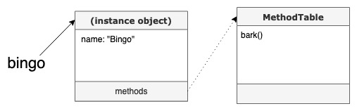
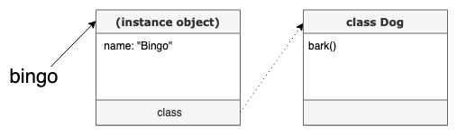
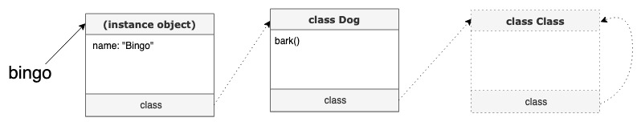
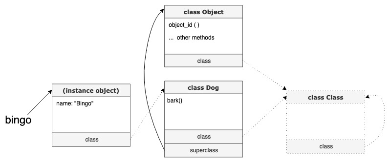
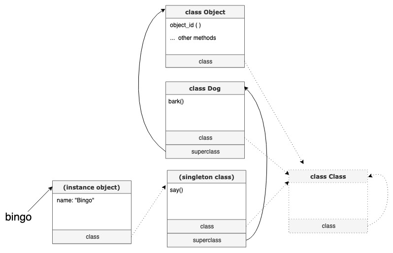
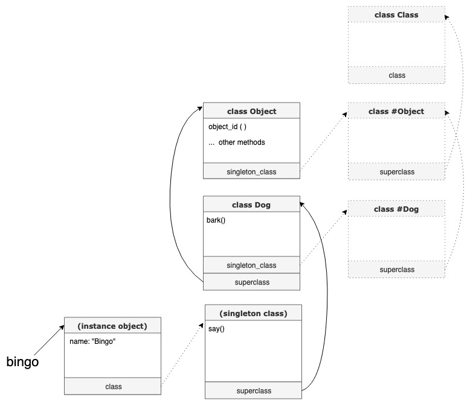
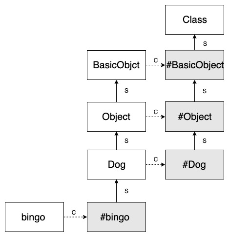

先前看了 [Metaprogramming Ruby](https://www.tenlong.com.tw/products/9781941222126) 這本書，對於 Ruby 語言在實踐物件導向的方式有初步的了解，但整本書像是利用故事的方式來帶入觀念，難免不夠精練。直到最近看了泰安大大推薦我一部 [Dave Thomas 在解釋 Ruby Object model 的 talk](https://www.youtube.com/watch?v=X2sgQ38UDVY) 之後，完全是貫穿了之前破碎和模糊的觀念，趁著忘記之前趕緊寫下這篇文章。

本篇文章主要內容是消化來自 Dave Thomas 的 talk 和 Metaprogramming Ruby 一書的內容，會分兩篇撰寫：

1.  第一篇是說明 Ruby 如何用 Object Model 來實踐物件導向。
2.  第二篇會加上 Module 的內容，以及補充一些之前沒搞懂的零碎觀念。

# 快速回憶物件導向

物件導向是模擬現實生活中物件的一種程式抽象化概念。假設現實世界中每個物件都有他的狀態（state）以及行為（behavior），而對照到程式的物件導向中就會變成實例變數（instance variable）和方法（method）。

類別（ class ）就像是個模子，模子本身是不可以直接拿來使用的，唯有將類別實例化成物件（ object )，才可以被拿來「使用」。簡單的說像是人類只是一種定義，人類會講話、站立行走，而你我都是人類的「實例化」，就是一個個活生生的人。

# Ruby 的物件導向

在很多物件導向的語言中，`class` 是一個關鍵字，而對於萬物皆物件的 Ruby 來說，`class` 也一樣是個物件。

讓我們來看一個簡單的類別與實例化範例：

```ruby
class Dog
  def get_name(name)
    @name = name
  end
  def bark
    puts "My name is #{@name}!"
  end
end

bingo = Dog.new
bingo.get_name("Bingo")
bingo.bark  # => My name is Bingo!
```

`@name` 是 bingo 這個物件的 instance variable，而 `bark()` 是 bingo 可使用的 method。因為每個物件的 instance variable 會不一樣，所以 `@name` 一定是放在 bingo 身上；而所有 bingo 可以使用的方法，都會參照到一個方法列表裡面。  


這個方法列表其實就是 Dog 類別，而他身上存放著一個 `bark()` 這個實例方法（instance method），讓他的實例物件（也就是 bingo ）來使用。  


Dog 類別事實上也是一個實例化過後的物件，它是由 `Class` 這個類別來實例化出來的一個物件。  
那 `Class` 的類別又是誰呢？就是他自己啦 ...  


bengo 可以直接呼叫 `object_id` 來了解到物件本身的 id 是多少：

```ruby
bingo.object_id  # =>70226738078560
```

雖然 Dog 裡面並沒有定義 `object_id` 這個方法，這個方法其實是因為 Dog 繼承自 Object，而 `object_id` 是來自於 Object 的方法!

```ruby
Dog.supserclass # => Object
```



> > 其實在 ruby 2.0 之後 Object 上層還有個 BasicObject, 而中間還有個 Kernal 模組, 事實上大部分 Object 身上可以用的方法像是 `object_id` 這種都是來自於 Kernal 模的，但我們這邊先不細部的探討，只要知道這是從上層繼承而來的。有興趣的可以透過 `Object.instace_methods(false)` 來查詢真正掛在 Object 身上的方法，透過 `Object.ancestors` 來查看 Object 上層還有哪些東西，在文章最後我們會將這些東西補完上去。

所以到這裡可以歸納出簡單的原則：

*   物件本身的實例變數，是放在自己身上
*   物件要呼叫方法，**會先往右（class），再往上（superclass）** 找。以上面這個例子來說，bingo 呼叫方法時，會先往右 （Dog）找，再往上（Object）找。

# self

這裡插播一個重要的觀念 - `self`。

`self` 代表當下的：

*   current object 是誰
*   intance variable 放置的地方
*   default reciever from method calls （ reciver 的觀念請看 xx ）

而 `self` 只有在下面兩個情況下有可能會改變

1.  呼叫 method 的時候
2.  定義 class / module 的時候

```ruby
puts self # => main
          ## 如果上面沒有其他 class，在執行環境下最頂層的物件就是 main 物件

class MyClass
  puts self # => MyClass
  def my_method
    puts self
  end
end

obj = MyClass.new
obj2 = MyClass.new
obj.my_method  # => obj
obj2.my_method # => obj2

```

為什麼 self 重要呢？

以前我都忽略了這個重要的觀念，常常搞不懂到在哪個狀況下可以用哪個 instance variable，但知道 self 是誰後一切就很清楚了。

例如以下的範例：

```ruby
class MyClass
  @v = 1
  def my_method
    puts @v
  end
end

obj = MyClass.new
obj.my_method  #=> nil
```

為什麼會出現這種結果？

因為第一個 `@v = 1` 的時候，self 代表的是 MyClass，也就是，所以這個 instance variable 是屬於 MyClass 這個物件自己的（你要說是 class variable 也是可以）。而在 `obj.my_method` 的狀況下，裡面的 `@v` 已經算是 obj 自已的 instance variable 了！

# Singleton method

更進一步的來挖掘 Ruby 物件導向，先來認識一個叫做 **Singleton method** 的東西。

Singleton method 就是 Ruby 允許物件自己擁有的專屬的方法：

```ruby
class Dog
  # ...
end

bingo = Dog.new

# singleton method
def bingo.say
  puts "Meow"
end

bingo.say # => Meow
```

這個 method 其他人都不能用，只有 bingo 可以用。

如此一來，這個 `say()` 的 singleton method 一定不是放在 Dog 身上，而依照我們前面的規則， method 是要**先往右（class）再往上找 ( superclass )**。

這時候就有點尷尬了，這個 `say()` 要放在哪裡？

# Singleton class

為了解決這個問題。 Ruby 設計了一個沒有名字的 class 讓物件來放這個專屬的 method，當然這個無名 class 也是專屬於這個物件的，我們叫他 **singleton class**  


為了要讓繼承鍊可以搜尋到 Dog 或是更父層的類別，bingo 的 singleton class 繼承自 Dog，而 bingo 的 class 事實上是指向他自己的 singleton class。

如果像是上面的範例，只是在實例物件上放一個特別的 method，好像沒麼實際上的應用價值。  
讓我們繼續看下去...

# Class method 事實上也是個 singleton method

class method 在大部分的範例都會這樣展示

```ruby
class MyClass
  def self.my_class_method
    puts "This is class method"
  end
end

MyClass.my_class_method  # => This is class method
```

其實在 class 定義區塊裡，程式碼也是可以直接執行的，所以 class method 也可以這樣使用：

```ruby
class MyClass
  def self.my_class_method
    puts "This is class method"
  end
  
  my_class_method
  # 要用 self.my_class_method 呼叫也可以
  # 但因為這裡的 self 就是 MyClass，所以預設的 method receiver 就是 MyClass
end
```

這個場景很熟悉！舉些以下幾個常看到的：

*   在 class 定義中使用到的 setter getter 設定 - `attr_accessor`
*   `before_save`、`after_commit` 這些在 Active Record 裡面常見的 callback
*   rails controller 裡面的 `before_action`

這些都是 class method。**某個 class 物件自己獨有的 method，這樣看來不也也算是 singleton method 嗎？**

也就是說這些類別們也應該會有個 singleton class 來放置這些 class method  
所以畫起來圖片會變這樣（用 # 來表示 singleton class）：  


所以當 Dog 在呼叫自己可以使用的 class method 時，一樣遵照我們之前說的規則：**先往右、再往上**找，一直到碰到 class Class 為止。

簡化一下上面這張圖，另外再補上最上層的 BasicObject，最後的圖會長成這樣：  


（ S: 指向 superclass，C: 指向 singleton class 或 class。 # 代表該物件是某 singleton class )

這個就是基本 Ruby 實踐物件導向的概念。我們快速的回憶一下上面講的重點

*   Instance variable 是放在物件自己身上
*   物件呼叫 method 的時候，一定是**先往右、再往上**。
*   搞懂 `self` 代表的是誰。只有在定義 class 和 呼叫 method 的時候，`self` 才有可能會改變。
*   class 自己定義的 instance method 是給他的 instance object 使用的。而 class 自己才可以使用的 method 叫做 class method。
*   class method 就是 singleton method，放在 singleton class 裡面。

在 Ruby 的繼承練上還可以你使用 Module 來擴充 method（還記得前面提到的 Kernel module 嗎？），下一篇將會討論它的應用方式，以及一些 Ruby 物件導向的冷知識。