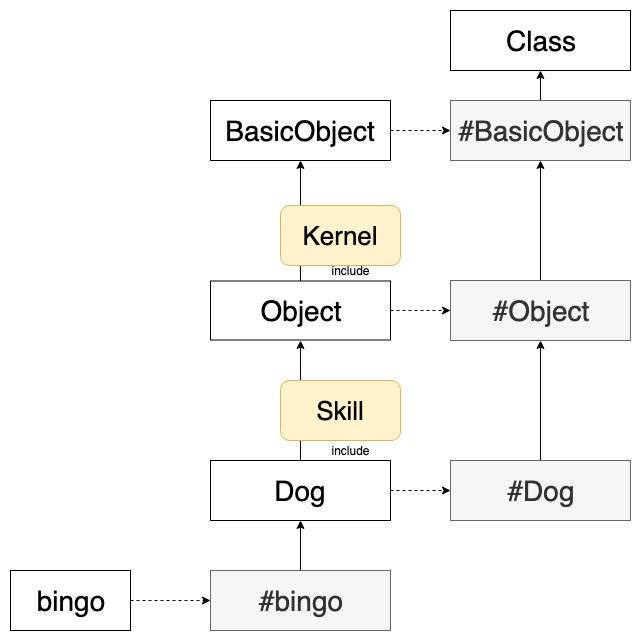
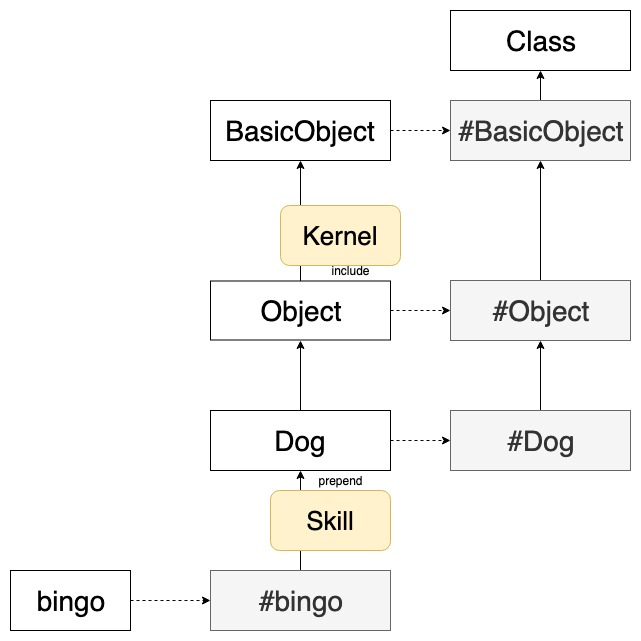
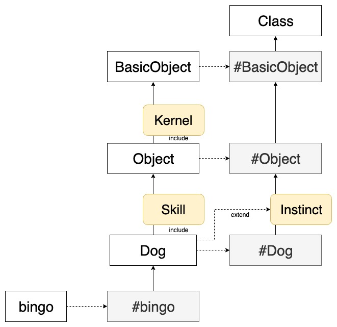

上一篇解釋了 Ruby 如何用全物件來實現物件導向後，在 Ruby 繼承鏈中找尋方法時還有一個很重要的東西 -- module。  
本篇將延續上一篇的內容，討論如何透過 `include` `prepen` 和 `extend` 來引入 module。

# include

加入模組最常用到的是 `include`。

當一個 class 使用 `include` 引入 Module 的時候，會將 Module 內的 method 增加為自己的 instance method

```ruby
module Skill
  def sit
    puts "sit down please"
  end
end


class Dog
  include Skill
  # ...
end

bingo = Dog.new
bingo.sit  # => sit down please
```

* * *

以繼承練的順序來說，是放在 class 的上方：

```
> Dog.ancestors
=> [Dog, Kill, Object, ...]
```



# prepend

而如果使用 `prepend` 來引入 Module, 則會放在繼承練的下方



其實很難想像有什麼場景可以使用到 `prepend`，有興趣的可以參考這篇[文章](https://medium.com/@leo_hetsch/ruby-modules-include-vs-prepend-vs-extend-f09837a5b073)中用了 debugger 的例子來展示 `prepend` 的應用場景。

# extend

`extend` 則是會將 Module 引入到 class 的 singleton class 上方。  
也就是說 Module 的 method 會變成 class mehtod

```ruby
module Instinct
  def run
    puts "Dogs can run"
  end
end

class Dog
  extend Instinct
  # ...
end

Dog.run # => Dogs can run
```



# Hook methods

在繼承類別或者引入模組的時候，有一些內建的 hook methods 可以使用：

*   `Module#included`
*   `Module#extended`
*   `Module#prepended`
*   `Class#inherited`

舉例來說，include module 後會觸發 `included`

```ruby
module MyModule
  def self.included(base)
    puts "MyModule is included to #{base}"
  end
end

class MyClass
  include MyModule
end

# => MyModule is included to MyClass
```

像是要實現 Rails 的 [Concern](https://api.rubyonrails.org/v5.2.2/classes/ActiveSupport/Concern.html)，可以使用 hook method 來達到同時可以引入 instance method 和 class method 的功能：

```ruby
module M
  def self.included(base)
    base.extend ClassMethods
    base.class_eval do
      scope :disabled, -> { where(disabled: true) }
    end
  end

  module ClassMethods
    # ...
  end
end
```

當然在實務上來說，在 Rails 中直接使用 Concern 還是看起來簡潔許多的！

(後來覺得這篇關於 module 的部分還是先獨立出來，下一篇再來整理些 Ruby 物件導向的冷知識。)