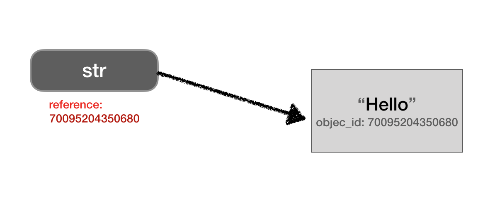
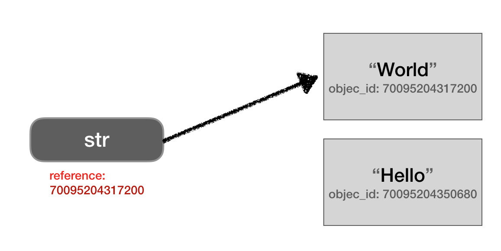
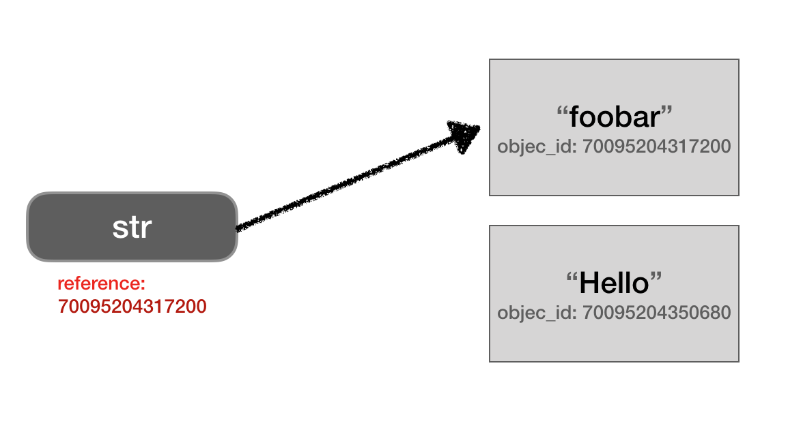
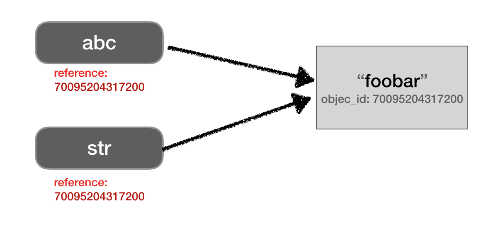
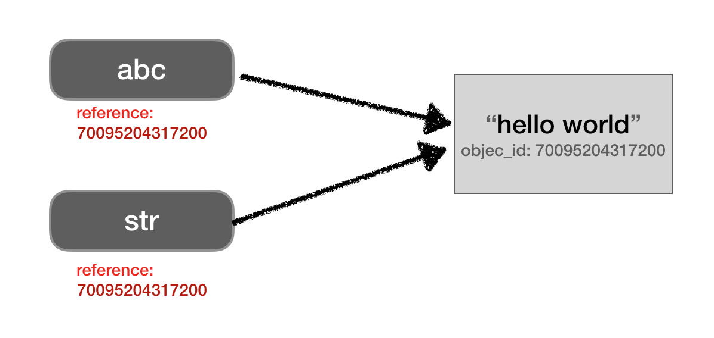
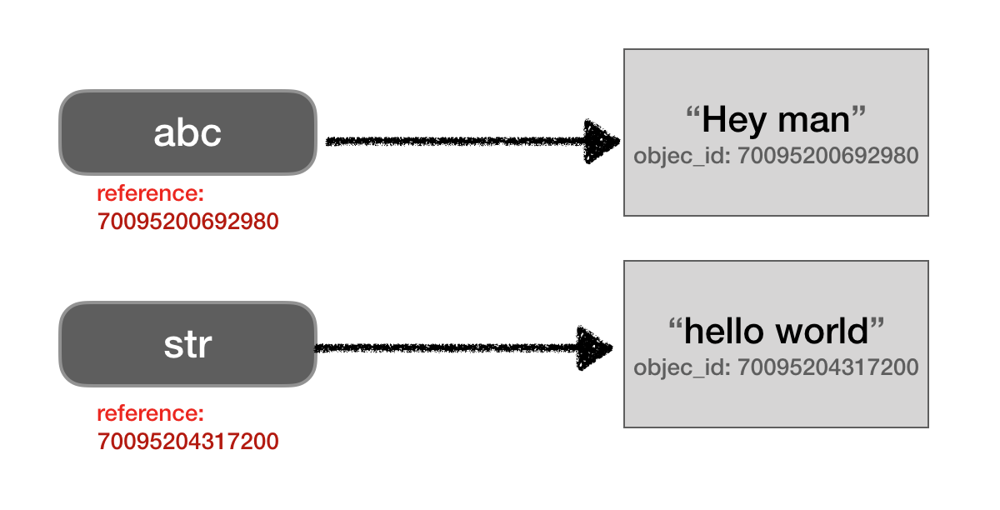

以前在寫 C, C++ 處理指摽、reference 是一個重要的課題，寫到 Ruby 時並沒有像是 C 可以宣告一個 pointer (\*)，但不代表 reference 這個觀念不重要，而且因為 Ruby 沒有明定 pointer type，一開始接觸時也常常踩雷。

# 什麼是 Reference

在 Ruby 中，每個**物件**一定有一個**參考**指向它，當一個物件沒有 reference 指向它，就是一個無主的物件。  
換個方法來解釋，變數其實就是一個存放位址的東西，這個位址就是物件的位址，這條連著的線就是「參考（Reference）」

```ruby
irb > str = "Hello"
 => "Hello"
irb > str.object_id
 => 70095204350680
```

在這個範例中，在電腦中應該長得像這樣  
  
當我們指派一個新的 String 給 `str`，這個參考就會完全改變：

```ruby
irb > str = "World"
 => "World"
irb > str.object_id
 => 70095204317200
```

  
如果使用 `replace()` method ，就在原本參考物件上面更新值，而不是給一個新的物件：

```ruby
irb  > str.replace("foobar")
 => "foobar"
irb  > str.object_id
 => 70095204317200
```



# Copy by reference

如果 `abc` 複製 `str`，事實上是複製 `str` 的參考，兩個變數還是指向同一個物件

```ruby
irb  > abc = str
 => "foobar"
irb  > abc.object_id
 => 70095204317200
```

  
因此如果用 `abc.replace("hello world")` ，就會改到同一個參考物件的值

```ruby
irb > abc.replace("hello world")
 => "hello world"
irb > str
 => "hello world"
```

  
如果重新給 `abc` 一個新的字串物件，他們就分道揚鑣啦

```ruby
irb > abc = "Hey man"
 => "Hey man"
irb > abc.object_id
 => 70095200692980
```

  
Ruby 的型別都是類別，所以其實不是只有陣列和字串會有這種特性，只是在處理字串和陣列常常會使用一些方法操作而去修改到參考物件中的值，不注意很容易有意外的結果。

# Mutating and Non-mutating method

知道 Ruby 變數有傳遞參考的特性之後，函式在使用參數也是一個常常踩到的雷。

```ruby
def func(a)
  a.upcase!
  a.concat("!!!")
end
str = "hello"
func(str)
puts str
#HELLO!!!
```

比如說這個例子，我們丟了一個 String 進去，其實是丟了物件的 reference，因此如果裡面有修改到物件本身，`str` 的值也會被改變。但如果改成以下這樣

```ruby
def func(a)
  a = a.upcase
  a.concat("!!!")
end

str = "hello"
abc = func(str)
puts str
# hello
puts abc
# HELLO!!!
```

`str` 原本的值就不會被改變了，因為在 `a = a.upcase` 這裡其實就已經產生了一個新的 reference。

再說一個 Mutation method的案例

```ruby
def func(a)
  a.each_index do |i|
    a[i] = 0
  end
end
arr = [1,2,3,4,5,6,7,8]
func(arr)
print arr
# [0, 0, 0, 0, 0, 0, 0, 0]
```

如果傳遞 array 到 method 裡面，因為 method 內的 `a` 跟外面的 `arr` 是同一個 reference，如果直接對 array 中的元素操作就會修改到原始物件的值。

參考資料：  
[https://launchschool.com/blog/references-and-mutability-in-ruby](https://launchschool.com/blog/references-and-mutability-in-ruby)  
[https://launchschool.com/blog/mutating-and-non-mutating-methods](https://launchschool.com/blog/mutating-and-non-mutating-methods)  
[https://launchschool.com/blog/object-passing-in-ruby](https://launchschool.com/blog/object-passing-in-ruby)