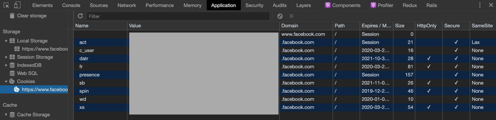
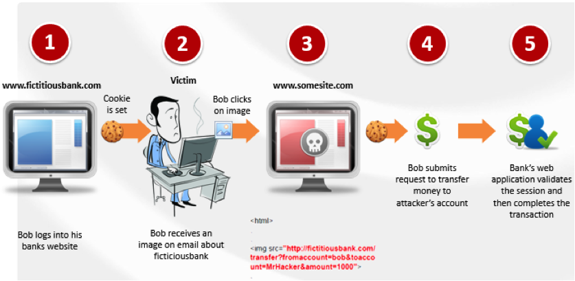

對於現代 web 開發框架來說，登入驗證幾乎都有成熟的 library 可以使用，例如 Rails 可以搭配 Devise gem 快速的搭建一個會員登入的系統。但是如果在前後端分離的單頁式網頁（Single Page Application ，以下簡稱 SPA）上，該怎麼跟後端的 API server 好好說哈囉呢？

本文會先討論我們每天在接觸的一些網站基本原理：

*   一般網站如何實作登入
*   Cookie、localStorage 與 sessionStorage
*   API server 怎麼做身份登入驗證

接著會回到本文的重點

*   SPA 該怎麼實作登入驗證
*   Rails 和 SPA 怎麼做登入驗證

# 一般網站如何實作登入

一切的故事從這句話開始:「HTTP 是一個 stateless 的[協議](https://tools.ietf.org/html/rfc2616)」

因為每次的交談（ Request - Response）都是無狀態，所以狀態必須由 client 或 server 端來維持。因此簡單的來說透過瀏覽器登入網站的行為會有點像這樣：

1.  當使用者登入送出帳號密碼
2.  Server 驗證帳密無誤，回傳一個「已登入」的通行證
3.  使用者瀏覽登入後的頁面，這時候就會夾帶著通行證一起發送
4.  Server 確認通行證有效，然後回傳登入限定的內容

那麼這個通行證怎麽核發和保存呢？  
最早的瀏覽器為了在無狀態的 HTTP 上讓 client 端可以保存這個通行證（保留登入狀態），所以發明了 cookie 這個東西。

## Cookie 可以由 Server 端設定

Server 回覆 response 給 client 的時候，可以在 response 內使用 `Set-Cookie` 來直接指定瀏覽器要設定的 cookie 內容:

```
HTTP/1.0 200 OK
Content-type: text/html
Set-Cookie: login_state=fred_is_login_passport

[page content]
```

瀏覽器收到 response 後，除了依照指示寫入 cookie，下次對這個 server 發送 request 的時候還會自動帶上這個 cookie，這樣一來就可以達到登入的狀態保存囉。

## 打開瀏覽器看看實際的狀況

我們來打開一個已經登入的 Facebook 網頁來觀察一下實際的行為。以 Chrome 為例，打開 `開發者模式` > `Application` > `Cookies` 下看看到底被設定了哪些 cookie



雖然不確定這些 cookie 個別的功能，但如果把他們全部清掉，Facebook 因為認不得我們所以就被登出了。

此外我們會發現 cookie 上有很多參數可以設定，他們都有各自的功能：

*   `Expires/Max Age`：這條 cookie 存活的時間，過期的就不會被瀏覽器夾帶在 request 內。
*   `SameSite`：限制瀏覽器不能跨站寄送 cookie
*   `Secure`：只有在 HTTPS 連線下才會傳送給 server
*   `HttpOnly`：開啟它會使瀏覽器執行的 JavaScript 沒辦法透過 `document.cookie` 來讀取到這條 cookie
*   `Domain` 和 `Path`：定義 cookies 應該被送到哪些 url

（更多細節可參考 [MDN 的說明](https://developer.mozilla.org/zh-TW/docs/Web/HTTP/Cookies) )

# Cookie、localStorage 與 sessionStorage

除了 Cookie 之外，瀏覽器們接著又發展出了 localStorage 和 sessionStorage 來讓我們放東西，不過他們可以做到的事情不太一樣，先來個比較表吧：

Cookie

localStorage

sessionStorage

Server 端設定

O

X

X

Client 端設定

O

O

O

Size

4k

~5mb

~5mb

Request 自動夾帶

O

X

X

前端 js 易用性

差

好

好

保存期限

可由server 端設定 max age, client 端生成的在關閉後就清空

同源的網頁可以存取，關閉網頁重開後還會存在

關閉頁面後就不存在

瀏覽器對這些新夥伴也提供了好操作的 API 供使用，以 localStorage 為例：

```js
localStorage.setItem('myCat', 'Tom');
var cat = localStorage.getItem('myCat');
localStorage.removeItem('myCat');
localStorage.clear();
```

倒是最早發展的 cookie 卻沒有類似的 api 讓人使用，除非要自己[包裝](https://stackoverflow.com/questions/10484090/how-to-get-key-value-from-cookies-which-was-set-in-javascript-asp-net-mvc3)。一開始覺得這件事情也太奇怪，難道使用 cookie 就是老窮殘？

不過到後來我才了解到：「Cookie 其實是不太希望 client side 來操作的」

原因是因為假如我們的前端網頁如果很容易存取到這些資訊的話，相對的它也容易暴露在風險之中！例如 localStorage 和 sessionStorage 雖然容易在瀏覽器內使用 js 操作，但假如網站被植入惡意 js 程式碼，你放在 localStorage 上的東西就會被盜用了（這個手法叫做 XSS 攻擊）。因此像是一些 credential 的東西，其實是不適合放在 localStorage 和 sessionStorage 內。

# API Server 通常怎麼交換登入通行證

先不考慮 SPA 的場景下，API server 是怎麼做身份驗證呢？

比較常見的 API server 的登入流程：

(1) client 對 server 的登入 api 發送帳號密碼

```
POST /signin
Host: api.hello-who.com
Content-Type: application/json

{
  "username": "fred",
  "password": "fredsecretpassword"
}
```

(2) Server 端驗證後核發通行證（token），一般來說可能是用 json 格式回傳給 client

```
{ "token":"AbCdEf123456" }
```

(3) Client 端如果要存取限制的資源，就會把 token 夾帶在 request 的 `Authorization` Header 裡

```
GET /secret_cats
Host: api.hello-who.com
Authorization: Bearer AbCdEf123456
Content-Type: application/x-www-form-urlencoded
```

(4) Server 端會先驗證 `Authorization` header 內的 token 是否合法，再回傳請求的資源。

(5) 如果 Server 段驗證 token 不合法，則回傳 `401 - Unauthorized`

_（實際上可能會有很多的實作細節可以探討，例如 token 使用 JWT、驗證方式採用兩階段登入、oauth 2 等等的。）_

但如果這個方法套用在純前端的單頁式網頁上，就會遇到一個問題：

「瀏覽器端該如何保存這個回傳的 token 呢？」

前面我們已經提到，如果在 client side 設定 cookie、localStorage 和 sessionStorage 看起來似乎都不太安全，那該怎辦才好？

# SPA 該怎麼實作登入驗證

假如我們今天的 client 端是瀏覽器的情況下，較安全保存 credentail 的方式還是從 server 端透過 `Set-Cookie` 的方式來設定。

你以為這篇文章就這樣結束了嗎？

其實要能動，還有很多需要處理的細節...

## Same Origin Policy 的問題

瀏覽器都有實作同源政策，基於安全性考量它限制了兩個不同網域來源互動行為。要怎麼認定是否同源以及相關的規範可以參考[相關的資料](https://developer.mozilla.org/zh-TW/docs/Web/Security/Same-origin_policy)，這裡只簡單提到我們可能會遇到的問題：

> 瀏覽器的 api 請求與 server 不同源

如果你的 SPA 所在的 domain 跟 api server 是同一個網域當然是可以爽爽用... 但通常可能會是 SPA 所在的 url 是 `www.hello-who.com`，api server 的 url 是 `api.hello-who.com`，這種情況就不屬於同源了。  
XMLHttpRequest（也就是俗稱 AJAX 啦）想要發送跨來源請求，是會被瀏覽器阻擋下來的。

通常要允許跨域的問題，要在 server 端設置一些允許跨域的 response header (CORS)

```
Access-Control-Allow-Origin: *
// 但這樣設定是裸奔啦，基本上不建議設全開
```

當瀏覽器知道你的 web server 是允許跨域存取的時候，就會幫你把 AJAX 的請求發出去

> cookie 同源的問題

cookie 依樣會有同源的問題需要處理。cookie 上可以設置 `Domain` 和 `Path`，這可讓瀏覽器知道他是作用在哪個網域上。所以說如果 API server 設定 cookie 的 Domain 是 `api.hello-who.com` 的話，前端網站 `www.hello-who.com` 再次發送請求的時候，原本那張 cookie 是不會被帶到發往 `api.hello-who.com` 的 request 上的。

## CSRF 的問題

Cross-site request forgery 跨站請求偽造的手法就是惡意網站用釣魚手法讓你送出你已經拿到 cookie 的網站請求。舉個例子：



_(Image credit: Venkatesh Sundar)_

1.  使用者已經登入了銀行網站
2.  駭客用社交攻擊手法讓你打開釣魚網站，該網站有偷偷嵌入銀行的 form 表單（例如說轉帳的表單）
3.  使用者在不知情的狀況下在釣魚網站對銀行送出這個 form 表單，因為也登入了銀行取得了 cookie，所以也會一併的帶上 cookie。
4.  駭客開心收到你的轉帳。

所以 cookie 被惡意網站內嵌的 form 表單偷渡了。

> ㄟㄟㄟ那說好的同源政策呢？

... 瀏覽器的同源政策只能限制 JavaScript 程式碼跨域的行為，對原生 html tag 卻沒效力！！！！！

（其實 cookie 上的 `SameSite` 的參數就是用來保護 csrf 的，但是因為蠻新的所以不確定所有的瀏覽器都有實作這段）

所以最常見的防護手法，就是 server 端先另外交給 client 端一個 `csrf token` （第二個通行證），server 端下次收到請求的話除了會驗證 cookie，也要驗證使用者有沒有帶上 csrf token。

## 盤點一下到底要我們要處理什麼事情

看來有很多細節要注意：

*   SPA 登入後， Server 端要設定 cookie
*   Server 端要設定 CORS
*   SPA 和 server 要處理 cookie 跨域的問題
*   SPA 和 server 要建立 csrf token 交換的機制

# Rails 和 SPA 怎麼做登入驗證

講了辣麼多，就來說說 Rails 怎麼蓋一個給 SPA 用的 api server 吧。

## 處理 cookie：Rails 的 Session store

Rails 有一個 `session` 方法來維持 client server 的 狀態，他預設的方式就是採用 cookies session storage 來存放，而且貼心的幫你加密（放在 `config/secrets.yml` 的那串東西，所以那串 key 請小心保存），簡單的說這還蠻符合我們希望透過 cookie 來發送通行證的想法，並且還送你一個加密功能，好棒棒！

所以我們要做的，當使用者成功透過 api 登入後，把可以辨識使用者的辨識碼寫入 session 內：

```rb
session[:user_id] = user.id
```

這裡用 user id 來代替，你可以依照使用情境自己產生 uniq token 或 jwt token。Rails server 會在這次的 response 加上 setCookie 回給使用者的瀏覽器。

如果你要驗證使用者有沒有登入，可以在 controller 上面加上一個驗證用的 before action 類似這樣：

```rb
def autenticate_spa_user!
  user_id = session[:user_id]
  @current_user = User.find(user_id)
  render unautorized_response if @current_user.nil?
end
```

## Protection From Forgery （處理 CSRF）

使用過 Rails 開發的人都知道它在一般網站的情境下預設提供了 [Protection From Forgery 的機制防範 CSRF](https://guides.rubyonrails.org/security.html#csrf-countermeasures)，但我們該怎麼把搬到 API 模式上來呢？

*   Rails 有提供一個 `form_authenticity_token` 可以讓我們手動生成 token
*   透過 cookie 的方式來交換 CSRF token：cookie 可以很方便做 token 的傳遞，而 JavaScript 在處理 api request 的知名 library [axios](https://github.com/axios/axios) 有很方便的方法可以處理在 cookie 內的 CSRF token。

#### Rails 端的設定

實作上可以在直接在 ApplicationController 上直接加個 before\_action：

```rb
class ApplicationController < ActionController
  before_action :set_csrf_cookie

private

  def set_csrf_cookie
    cookies['CSRF-TOKEN'] = form_authenticity_token
    # 'CSRF-TOKEN' 可以自己取別的名字
  end
end
```

> 這裡做了兩件事情。form\_authenticity\_token 實際上會亂數產生一組 token 並且在 Rails 內建立一個 `session[:_csrf_token]`，但是 Rails 下次並不會拿這個 session cookie 來直接驗證，而是要前端自己把 token 放在 request header 'X-CSRF-Token' 裡面打上來驗證。既然前端要使用，就必須另外塞 cookie 給它，這樣前端才可以透過 `document.cookie` 拿出來使用！

#### 前端 axios 的設定

設定前端 axios 發送 request 的時候可以帶上 csrf token：

```js
axios
  .get("/my-stuff", {
    headers: { "X-CSRF-Token": getCookie("CSRF-TOKEN") }
  })
  .then(response => {
    const myStuff = response.data;
    // render my stuff
  });
```

或者，可以直接指定為 default 值

```js
axios.defaults.xsrfCookieName = "CSRF-TOKEN";

axios.defaults.xsrfHeaderName = "X-CSRF-Token";

axios.defaults.withCredentials = true;
```

> 設定 withCredentials = true 目的是為了在發送 request 的時候可以讓瀏覽器帶上跨域的 cookie

## 開啟 Cross-Origin Resource Sharing（CORS 允許跨域）

為了讓解決跨域的問題（就是那個同源政策啦），我們要在 Rails 上設定 CORS

首先要安裝 rack-cors gem，它可以讓我們在 Rails 中設定 allow origins 的 response header。

請在 `Gemfile` 中新增這個 gem 然後記得下 `bundle install`：

```ruby
gem 'rack-cors'
```

接著新增一個 cors 使用的 initializer ，origins 請設定你的前端網域，

```ruby
# config/initializers/cors.rb
Rails.application.config.middleware.insert_before 0, Rack::Cors do
  allow do
    origins 'localhost:8080'
    # 如果要上 production 的話記得要換成 production site 網址

    resource '*',
      headers: :any,
      methods: [:get, :post, :put, :patch, :delete, :options, :head],
      credentials: true
  end
end

```

> 註：這裡常常有人很海派的把 `origins` 設為 wildcart (`*`)，除了這樣等於在外裸奔以外，如果 xhr 要交換 cookie（credentails: true）的狀況下，瀏覽器是會阻擋 wildcard orgins 帶上 cookie 的！

> 註：`credentials: true` 是為了跟 axios 設定 `.withCredentials = true;` 做搭配

#### 把 csrf 的 original check 關掉

雖然通過了瀏覽器的同源政策，但 Rail 的 protection from forgery 機制還是會去比對 origin，所以我們要在這份 initializer 下面多新增一個設定，把同源 csrf 檢查關閉：

```ruby
# config/initializers/cors.rb
# ...

Rails.application.config.action_controller.forgery_protection_origin_check = false
```

## Rails 在 API 模式下的設定

如果你的 rails 是透過 api 模式下長出來的（ `rails new my_api_server --api`）會少裝很多東西，包含我們需要的 Session 和 Cookie，所以要記得要補上：

```ruby
# application.rb
class Application < Rails::Application
  config.load_defaults 5.2

  config.api_only = true

  config.middleware.use ActionDispatch::Cookies
  config.middleware.use ActionDispatch::Session::CookieStore
end
```

另外如果你的 controller 是繼承 `ActionController::API` 的話，也要加上我們需要的 cookie 和 protect\_from\_forgery 功能：

```ruby
class ApplicationController < ActionController::API
  include ActionController::Cookies
  include ActionController::RequestForgeryProtection

  protect_from_forgery with: :exception

  # ...

end
```

## 前端使用 localStorage 來暫存登入狀態

雖然 Rails 在登入成功的時候會把登入狀態寫入 cookie，但因為這個 cookie 已經被設定 `HttpOnly`，其實前端沒辦法讀取。

我們可以在登入成功後在 localStorage 塞一個登入中的 flag，用來暫存登入狀態：

```js
axios
  .post("/session", { username, password })
  .then(response => {
    localStorage.setItem("loggedIn", true);
  })
```

> 註：因為這個 flag 並不是特別的機密資訊，所以放在 localStorage 是沒什麼問題的

或者更近一步可以請 rails server 在登入成功後回傳 user name 之類的基本資訊，我們就可以暫存在 localStorge 加以利用。

```js
axios
  .post("/session", { username, password })
  .then(response => {
    localStorage.setItem("user", JSON.stringify(response.data));
  })
```

# 其他補充

> 簡單的 Devise token auth 範例

先前幫我們公司 [ASTRO camp](https://astro.5xruby.tw/) 的學員寫過一篇示範 Devise 使用 API 登入的文章：「[在 Rails API 中使用 Devise 驗證](/rails_api_devise_login/)」，主要是手把手示範怎麼在已使用 Devise 的狀況下產生 token 以及核發 token，算是很粗淺的 tutorial。實際上還是建議依據 client 端的情況，設計較安全的驗證機制！

> jwt\_sessions

因為礙於篇幅本篇沒討論 JWT 相關的機制，但如果在 rails 中想要使用，可以參考 [jwt\_sessions](https://github.com/tuwukee/jwt_sessions) gem。如果你有看完本篇討論的內容，會發現 jwt\_sessions 也實作了很多相關的機制（session cookie、csrf）。

# 小結

單頁式網頁 Single Page Application 是近年來前端大爆發的產物，但整篇下來我們其實都在探討以下的原理：

*   HTTP stateless 的特性
*   在 HTTP 上如何保存 state：cookie、localStorage 和 sessionStorage 的比較
*   瀏覽器的同源政策
*   常見的攻擊手法：XSS, CSRF

藉由這個題目讓我們順便好好研究一下這些議題，瞭解 client 和 server 如何好好的說哈囉，新的一年也要開發出安全可靠的 web application！

> 上面每一個主題仔細探究都可以寫一整篇文章，怕離題太多所以很多細節都只能稍微帶過，如有未盡深感抱歉。假如你是剛接觸網路開發的朋友，建議可以個別用這些關鍵字來做深入研究！

感謝收看，我們下次見～（揮手）

# 參考資料

*   [Authentication in SPA (ReactJS and VueJS) the right way](https://medium.com/@jcbaey/authentication-in-spa-reactjs-and-vuejs-the-right-way-e4a9ac5cd9a3)
*   [w3c-JavaScript Cookies](https://www.w3schools.com/js/js_cookies.asp)
*   [w3c-HTML5 Web Storage](https://www.w3schools.com/html/html5_webstorage.asp)
*   [開發者必備知識 - HTTP認證（HTTP Authentication）](https://carsonwah.github.io/http-authentication.html)
*   [MDN - Same-origin policy](https://developer.mozilla.org/en-US/docs/Web/Security/Same-origin_policy)
*   [和 CORS 跟 cookie 打交道](https://medium.com/d-d-mag/%E5%92%8C-cors-%E8%B7%9F-cookie-%E6%89%93%E4%BA%A4%E9%81%93-dd420ccc7399)
*   [Using Rails Session Cookies for API Authentication](https://pragmaticstudio.com/tutorials/rails-session-cookies-for-api-authentication)