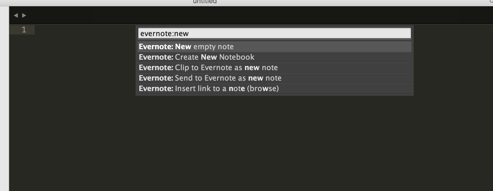
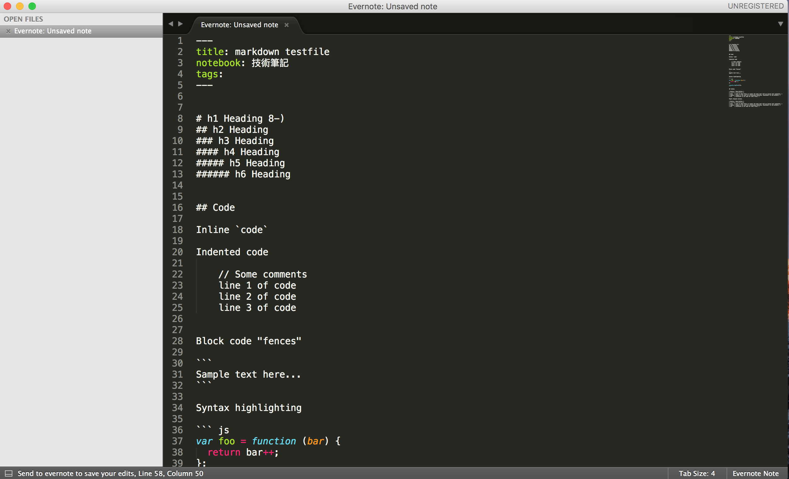
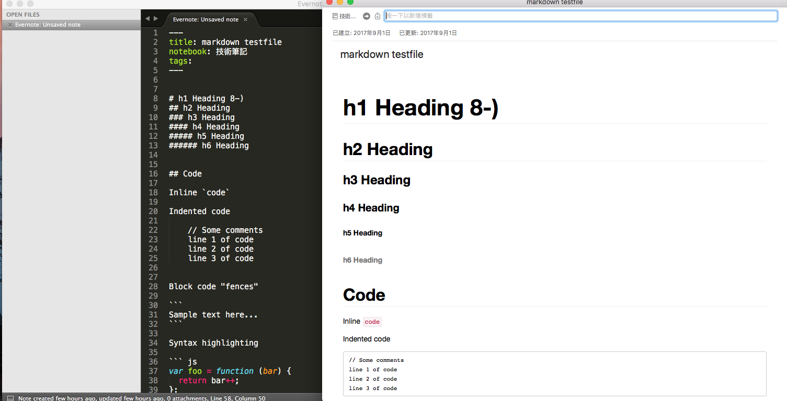
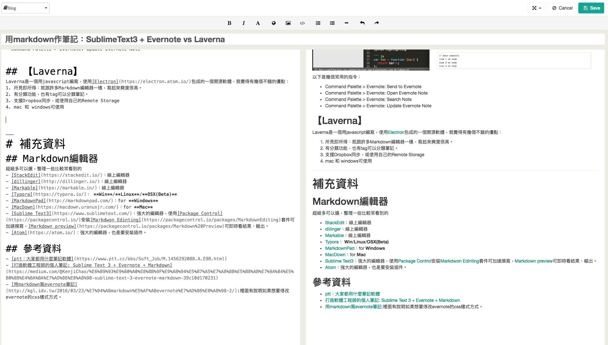
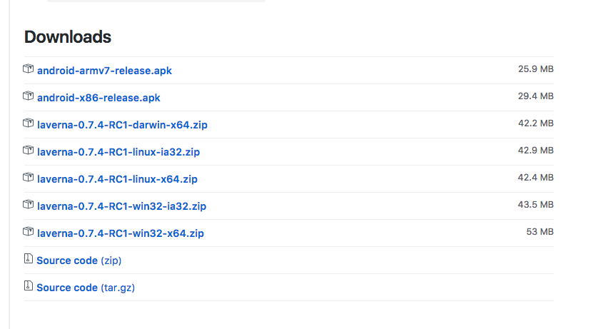
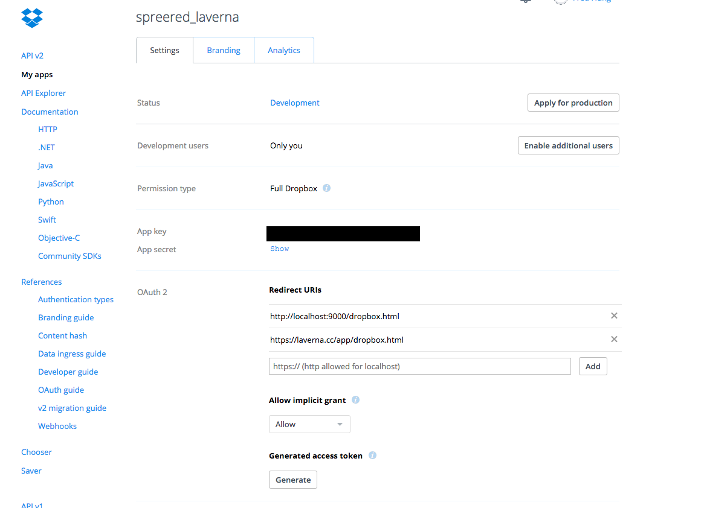
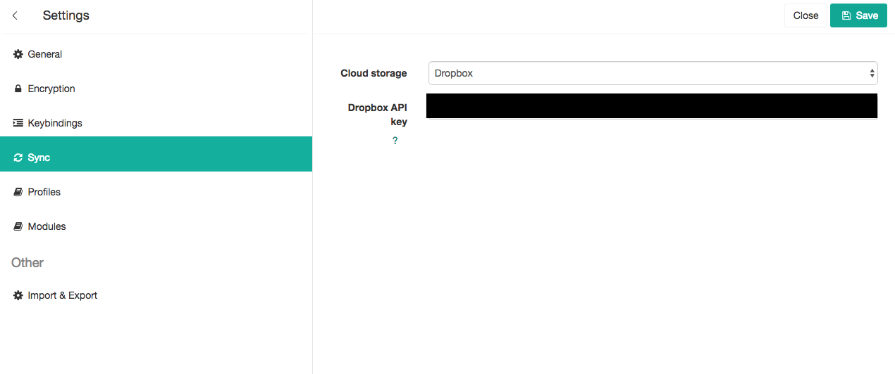

以前都把筆記放在Google Drive上面，但是Google Doc這種文書軟體其實不太適合程式類的筆記，於是乎前陣子看到ptt Soft\_job版上看到有關作筆記的討論，整理了一下這陣子的使用心得。

# 關於Markdown

Markdown是一個輕量化的標記語言，簡單的書寫，透過編輯器（最後有列出一些）就可轉換成美美的排版，書寫方式也非常直觀好學，直接閱讀也看得懂。接觸到Markdown是相見恨晚，尤其是在做程式筆記或技術文件上，幾乎可以減少干擾又很流暢的生出一個簡潔美觀的文件。

### 如何寫Markdown

可以參考 Gitbook裡的中文教學，非常容易上手：[Markdown | GitBook 中文解說](https://wastemobile.gitbooks.io/gitbook-chinese/content/format/markdown.html)

* * *

# Sublime Text3 + Evernote

利用Sublime Text的Evernote套件，同步至evernote帳號

### 1.安裝Sublime Text3及Package Control

*   安裝[sublime Text 3](https://www.sublimetext.com/3)
*   安裝[Package Control](https://packagecontrol.io/installation)：依照指示，在Sublime Text內按下 `` ctrl + ` `` 叫出console後，貼上那一大串的字在輸入框內。

### 2.安裝markdown套件

在sublime Text裡面按下`ctrl + shift + p` ，mac使用 `command + shift +p` 叫出Package Control Command Palette，輸入Package Control: Install Package，輸入你要安裝的套件名稱。以下安裝兩個套件：

*   [Markdwon Editing](https://packagecontrol.io/packages/MarkdownEditing)：加速撰寫markdown，比如`⌘⌥ V` 就是貼上連結，`⌘⇧K`就是貼圖，裡面都有說明教學。
*   [Markdown preview](https://packagecontrol.io/packages/Markdown%20Preview)(非必要)：安裝完成後使用 `ctrl + shift + p` ，mac使用 `command + shift +p` 叫出Package Control Command Palette，輸入`Markdown Preview`可以看到他列出的一些功能，比如說選擇`Markdown Preview:Preview in Browser`就可在預設的瀏覽器顯示被html+css消化過的markdown file。
*   [Markdown Live Preview](https://packagecontrol.io/packages/MarkdownLivePreview)(非必要)：如果要即時看到html輸出的結果，就安裝這套，`alt+m`就可以叫出live preview的編輯窗，但是markdown文件一定要儲存成`.md`檔，否則不能執行，如果我們要使用evernote的話就用不到這個。

### 3.安裝Evernote套件

同上一步驟，使用Package Control: Install Package，輸入Evernote來安裝套件。第一次使用，請用Command Palette > Evernote: Reconfigure 來設定evernote帳號連結，將NoteStore URL和token輸入到sublime Text裡面。詳細設定和使用方式可參考[這裡](https://packagecontrol.io/packages/Evernote)。

### 4.開始寫筆記

1.  打開submlime text，`Command Palette > Evernote:New empty note`

2.  然後就開工，編寫筆記啦。

3.  上傳筆記，`Command Palette > Evernote:Send to Evernote as new note`
4.  確認evernote已經產生美美的筆記 ([看結果](https://www.evernote.com/l/AEb3oh8_rYpKrpIyXRLq_9eGE638cHK_Elc))

以下是幾個常用的指令：

*   Command Palette > Evernote: Send to Evernote
*   Command Palette > Evernote: Open Evernote Note
*   Command Palette > Evernote: Search Note
*   Command Palette > Evernote: Update Evernote Note

* * *

# Laverna

Laverna是一個用javascript撰寫，使用[Electron](https://electron.atom.io/)包成的一個開源軟體，我覺得有幾個不錯的優點：

1.  所見即所得：就跟許多Markdown編輯器一樣，寫起來爽度很高。
2.  有分類功能，也有tag可以分類筆記。
3.  支援Dropbox同步，或使用自己的Remote Storage
4.  mac 和 windows可使用

### 安裝Laverna

[laverna.cc](laverna.cc)裡面可以直接線上使用，但我們為了就地端保存方邊，都使用桌面版的。laverna.cc面提供的是舊版本（0.7.1），在使用上發現這版在同步Dropbox會有無法登入的問題，所以要去他[github](https://github.com/Laverna/laverna/releases)下載最新版本。

選擇系統下載，如果Mac user請安裝**darwin**版。  

解壓縮後就可以快樂使用囉。

### 設定Dropbox 同步

以下步驟參考[laverna的官方FAQ](https://github.com/Laverna/laverna/wiki/FAQ)

1.  先確認有Dropbox的帳號 [https://www.dropbox.com/](https://www.dropbox.com/)
    
2.  登入Dropbox後，到API設定頁面 [https://www.dropbox.com/developers](https://www.dropbox.com/developers)
    
3.  "My Apps" -> "Create App"
    
4.  選擇 "Dropbox API", "Full Dropbox"，然後幫你的app取個名字
    
5.  Redirect URIs 加入兩筆url: "[http://localhost:9000/dropbox.html](http://localhost:9000/dropbox.html)"和 "[https://laverna.cc/app/dropbox.html](https://laverna.cc/app/dropbox.html)"
    
6.  Allow implicit grant  
    
    
7.  回到Laverna桌面版，Setting -> Sync
    
8.  選擇Dropbox，然後把剛剛app頁面的API KEY輸入上去
    

如果有多個裝置需要同步存取，比如說我家裡的mac安裝完後，到setting裡面匯出設定，再到辦公室的電腦匯入設定，這樣同步才不會有問題。

* * *

# 心得小評

### Evernote + sublime Text方案

*   跨平台支援度較高
*   還有額外支援很多功能，比如說擷取網頁、共享
*   免費版的有空間流量限制，資料放雲端有人不是那麼的安心，萬一人家gg就欲哭無淚
*   因為我的sublime裝了很多有的沒的套件，很容易與其他的key bindding衝突，也容易誤輸入到其它套件的snippet
*   sublime的live preview套件目前看來支援`.md`檔，而且一定要就地端存取才給執行，以我這個方案沒辦法使用
*   因為Medium不支援markdown，在Sublime Text撰寫的檔案必須透過編輯器轉出的結果來貼上

### Laverna方案

*   所寫即得
*   輕量化
*   文件都可自行保存
*   設定同步只支援dropbox，稍微麻煩
*   雖然可跨mac和windows ，但是開源軟體沒有ios版本，略顯可惜
*   編寫的markdown文件可以直接貼到我的Ghost blog，而要發佈在Medium的話，可以直接複製轉Laverna換出來的結果貼上，算是符合我目前的筆記及寫作需要。(本篇就是由Laverna編輯後貼上)

* * *

# 補充資料

## Markdown編輯器

超級多可以選，整理一些比較常看到的

*   [StackEdit](https://stackedit.io/)：線上編輯器
*   [dillinger](http://dillinger.io/)：線上編輯器
*   [Markable](https://markable.in/)：線上編輯器
*   [Typora](https://typora.io/)： **Win**/**Linux**/**OSX(Beta)**
*   [MarkdownPad](http://markdownpad.com/)：for **Windows**
*   [MacDown](https://macdown.uranusjr.com/)：for **Mac**
*   [Sublime Text3](https://www.sublimetext.com/)：強大的編輯器，使用[Package Control](https://packagecontrol.io/)安裝[Markdwon Edinting](https://packagecontrol.io/packages/MarkdownEditing)套件可加速撰寫，[Markdown preview](https://packagecontrol.io/packages/Markdown%20Preview)可即時看結果、輸出。
*   [Atom](https://atom.io/)：強大的編輯器，也是要安裝插件。

**(補充)** 雖然跟markdown無直接相關，但補充一下有一些服務可以直接嵌入UML圖：

*   [PlantUML](https://github.com/lyhcode/gitbook-plugin-plantuml)：撰寫Gitbook的時候可加上的UML
*   [js-sequence-diagrams](https://bramp.github.io/js-sequence-diagrams/)：在網站上產出UML後下載，或者是自行嵌入他的js檔
*   [yuml](https://yuml.me/)：用url就可產生UML圖，然後使用img標籤就可以嵌入圖檔，非常方便！ ([教學](https://yuml.me/diagram/scruffy/class/samples))

## 參考資料

*   [ptt：大家都用什麼筆記軟體](https://www.ptt.cc/bbs/Soft_Job/M.1456292088.A.E9B.html)
*   [打造軟體工程師的個人筆記: Sublime Text 3 + Evernote + Markdown](https://medium.com/@KenjiChao/%E6%89%93%E9%80%A0%E8%BB%9F%E9%AB%94%E5%B7%A5%E7%A8%8B%E5%B8%AB%E7%9A%84%E5%80%8B%E4%BA%BA%E7%AD%86%E8%A8%98-sublime-text-3-evernote-markdown-39c10d170231)
*   [用markdown寫evernote筆記](http://kgl.idv.tw/2016/03/23/%E7%94%A8markdown%E5%AF%ABevernote%E7%AD%86%E8%A8%98-2/):裡面有說明如果想要修改evernote的css樣式方式。